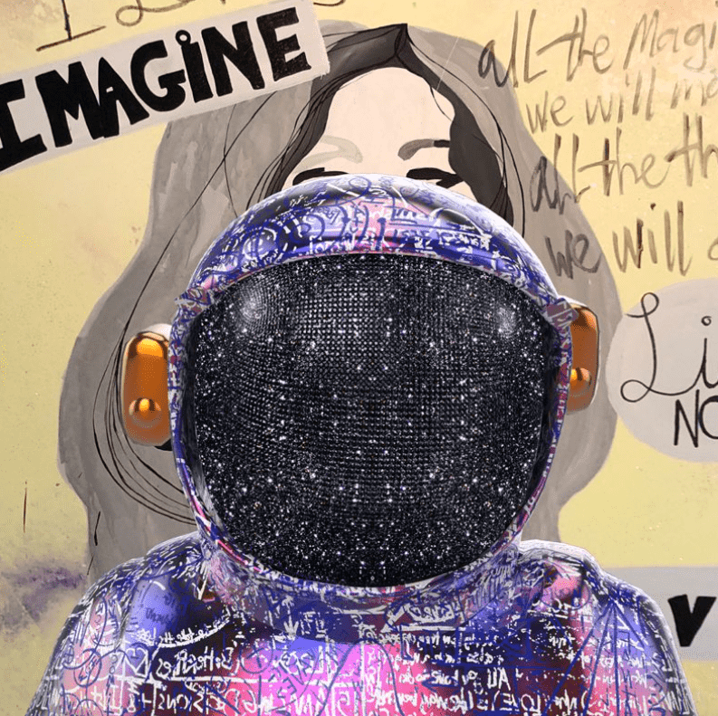

# Boonji Project

截至 2022 年 6 月 5 日，已销毁的 Boonji 代币：800 锁定在拼贴中的Boonji 代币：600 总可用代币：9,711 在以太坊区块链上启动的 Boonji 项目是由世界知名艺术家 Brendan Murphy 创建的独特数字不可替代代币的集合。 您的 Boonji Avatar NFT 不仅可作为一件可收藏的数字艺术品，还可作为护照，让您与 Boonji Spaceman 一起穿越未探索的星系。Boonji 项目官方收藏：Super Boonji | 露莉熊 | Boonji 实物赎回代币 | Boonji x 银河蛋

Boonji 项目是由世界知名艺术家 Brendan Murphy 在以太坊区块链上推出的 11,111 个独特的数字不可替代代币的集合。您的 Boonji Avatar NFT 不仅可以作为艺术品，还可以成为您与 Boonji Spaceman 一起环游世界和其他地方的护照，允许您访问仅限会员的活动、商品和实体/数字艺术品。随着 Boonji Spaceman 到达每个新星球，社区可以通过激活路线图来解锁一系列激动人心的奖励。

每个 Boonji Spaceman Avatar 都是独一无二的，并通过多种可能的特征以编程方式生成，包括 Boonji Spaceman Bust、独特的公式、背景、面罩等。所有 Boonji Spaceman Avatars 都包含 Brendan 一生中的艺术元素。其中包括来自他的原画、雕塑和世界各地的巨大文吉太空人雕塑的细节。每个 Avatar 都是独一无二的。但是，根据铸造 Avatar 时生成的算法，有些比其他的更罕见。这些稀有物品具有特殊的能力，可以解锁实物艺术品和体验。

