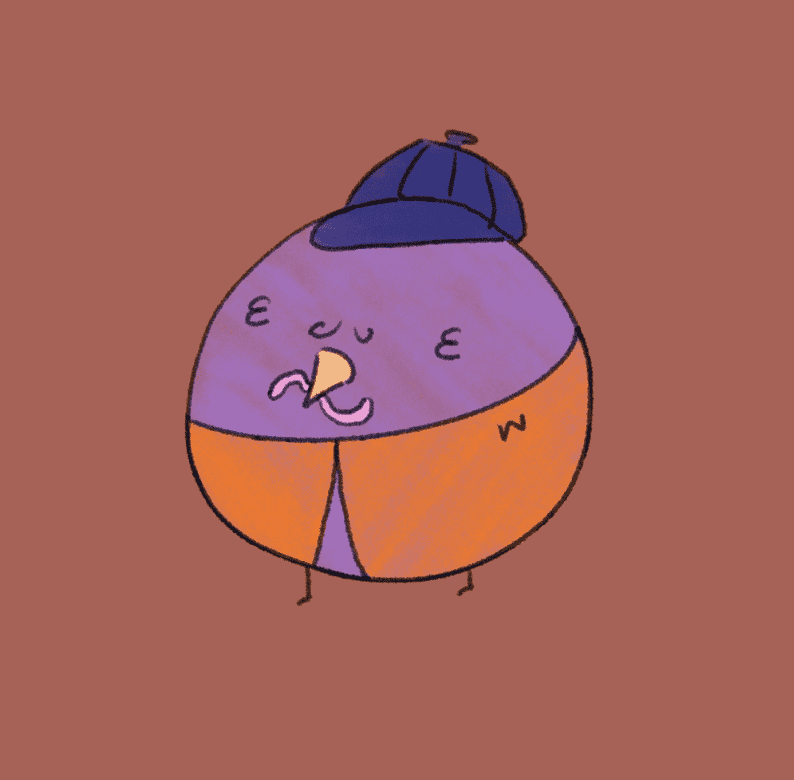

# borb.

5555 手绘小鸟准备离巢| CC0我是博尔。 你是鲍勃吗？

过去 7 天没有售出 CyborbChicken。

Linktr.ee/cyborbchicken

星际入侵者开始进入你的代谢物。在这里或广场。他们是来搅局的。现在得到你的！

我们网站上的使命宣言和路线图

20,000 1/1 独特的 Cyborb Chicken NFT。在所有 20,000 个中，某些属性只会出现 ~50 倍。史诗般的稀有！

borb NFT - 常见问题（FAQ）
▶ 什么是 borb？
borb 是一个 NFT（非同质代币）集合。存储在区块链上的数字艺术品集合。
▶ 有多少 borb 代币？
总共有 596 个 borb NFT。目前，660 位车主的钱包中至少有一个 borb NTF。
▶ 什么是最昂贵的borb 销售？
售出的最昂贵的 borb NFT 是 Cyborb Chicken P1。它于 2022-06-14（3 个月前）以 3.2 美元的价格售出。
▶ 最近卖出了多少 borb？
过去 30 天内售出了 5 个 borb NFT。
▶ 什么是流行的 borb替代品？
许多拥有 borbNFT 的用户还拥有 Alien OG NFT、 Wormz World Founders NFT、 PandaPalz 卡和 黑帮蛇蛋/nft 拼图。

