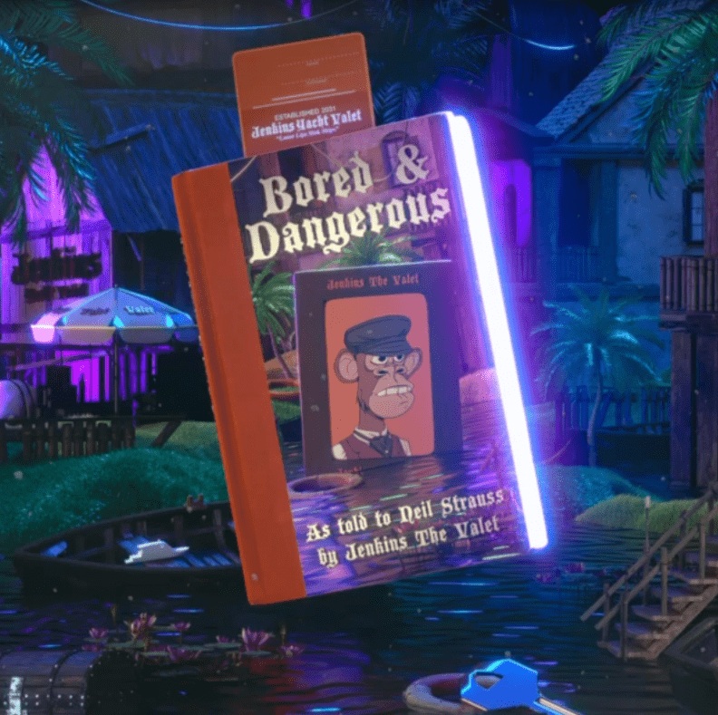

# Bored & Dangerous

Bored & Dangerous 已经酝酿了将近一年，对于 NFT 领域来说是一个历史性的时刻。 这部作品是 Jenkins the Valet 的“作家的房间”的 3,000 名成员联合起来推动作品的创作方向的结果。 10x 纽约时报畅销书尼尔施特劳斯写了这本小说。 小说、插图、“詹金斯在哪里”游戏中以及致谢中的所有角色均归社区成员所有，并授权给 Tally Labs。特别感谢 MBSJQ 创作了如此特别的艺术品和 Murda Beatz 产生了你在本书旋转时听到的节拍。这个 NFT 可能会被烧掉以换取 Azur Root（Azurbala 中的一种神圣物品，可以兑换 PFP）或作为 Hawthorn 的成员（一个致力于重新想象集体创造力的 DAO） .访问 www.jenkinsthevalet.com 了解更多信息，并与我们一起创造未来的社区生成作品。

