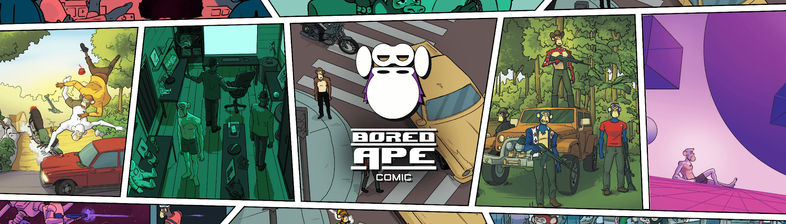

# Bored Ape Comic

无聊猿漫画#2 现已推出。问题由 10,000 个 NFT 组成，并包含一组无聊的猿。无聊猿漫画 NFT - 常见问题（FAQ）
▶ 什么是无聊猿漫画？
Bored Ape Comic 是一个 NFT（Non-fungible token）集合。存储在区块链上的数字艺术品集合。
▶ 有多少无聊猿漫画代币？
总共有 9,999 个 Bored Ape Comic NFT。目前，2,678 位所有者的钱包中至少有一本 Bored Ape Comic NTF。
▶ 最昂贵的无聊猿漫画销售是什么？
最昂贵的 Bored Ape Comic NFT 是 Bored Ape Comic #1：Gold，ID：1813。它于 2022 年 8 月 15 日（11 天前）以 28.1 美元的价格售出。
▶ 最近卖了多少无聊猿漫画？
过去 30 天内共售出 24 个 Bored Ape Comic NFT。
▶ 一部无聊猿漫画要多少钱？
过去 30 天，Bored Ape Comic NFT 最便宜的销售额低于 7 美元，最高销售额超过 28 美元。过去 30 天，Bored Ape Comic NFT 的中位价格为 14 美元。
▶ 什么是流行的无聊猿漫画替代品？
许多拥有Bored Ape Comic NFT的用户还拥有Bored Ape Comic PRE SALE（官方季票），Shaolin Samurai Warriors，BallerHeadz和Bored Ape Comic 2。

