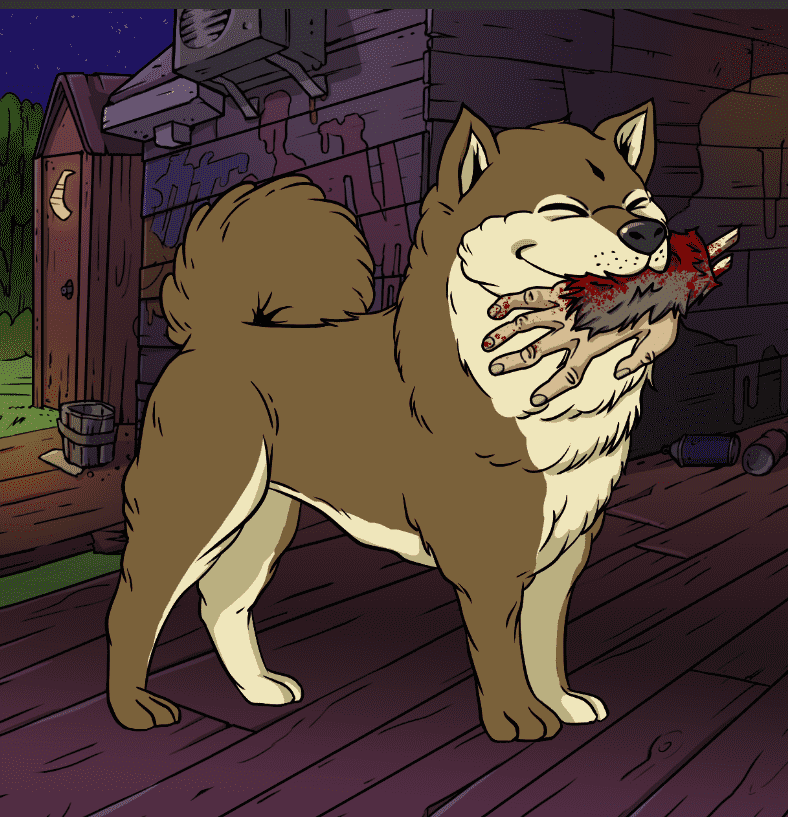

# Bored Ape Kennel Club

有时它会在沼泽中变得孤独。 这就是为什么每只猿都应该有一个四足的伙伴。 蜷缩在你的脚下。 给你带来啤酒。 向那个混蛋吉米猴子发射导弹发射器。这就是我们成立无聊猿犬舍俱乐部的原因，也是我们向 BAYC 的每一位成员提供狗 NFT 以供收养的原因——免费（您只需支付 gas）。我们在二次销售中产生的任何版税都将捐赠给慈善机构。 了解更多信息：http://boredapeyachtclub.com/#/kennel-club

时间不多了
在一周内，每个俱乐部成员都可以从无聊猿养犬俱乐部领养俱乐部狗 NFT。 领取代币是免费的； 你只需要支付汽油费。

这些幼犬不出售。 采用它的唯一方法是通过在你的钱包里放一只无聊的猿来认领它。 您可以为您拥有的每只无聊猿认领一只随机俱乐部狗。 一旦一只狗被无聊猿认领，该令牌就不能再次用于认领另一只犬。

在铸币时，这些狗将不公开。 一周后，即 6 月 25 日美国东部标准时间下午 6 点，采用活动将结束。 将设置一个随机的起始索引，每个人都可以遇到他们的同伴。

无人认领的狗？ 他们将被释放到沼泽中，再也见不到了。

