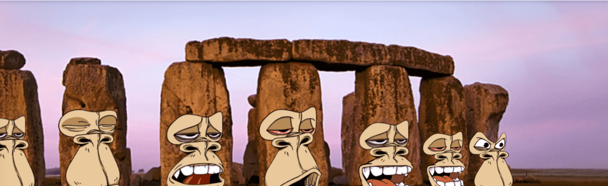

# Bored Ape Rock Club Genesis

这些岩石从一开始就坐在这里。他们在做什么？他们是什么意思？无聊猿摇滚俱乐部Genesis NFT - 常见问题（FAQ）
▶ 什么是无聊的猿摇滚俱乐部创世纪？
Bored Ape Rock Club Genesis 是一个 NFT（非同质代币）系列。在区块链上的数字收藏品存储集合。
▶ Bored Ape Rock Club Genesis 代币有多少？
4个Bored Ape Genesis NFT。目前有一个Rock Genesis NFT。目前，车的钱包中至少有一个NFT。
▶ Bored Ape Rock Club Genesis 最昂贵的促销活动是什么？
最贵的 Bored Ape Rock Club Genesis NFT 是 Bored Ape Rock Club #455。它于 2022-06-09（3 个月前）以 35 美元的价格售出。
▶最近卖了多少无聊的猿摇滚俱乐部Genesis？
过去 30 款推出了 Genesis AFT 17 款 Borpe Rock Club。
▶ Bored Ape Rock Club Genesis 的价格是多少？
在过去的 30 天里，Bored Ape Rock Club 创世纪 3 美元最便宜的价格为 Ape Rock Club NFT 3 美元，价格超过了 30 美元。过去 30 天，Bored 创世纪 3 美元为 Ape Rock Club NFT 的中位。
▶ 什么是流行的替代品？
Bored Ape Rock Club Genesis NFT 的用户还拥有 diana ugay、Alien Genesys、Addictswtf 和 The Decolife Collection 的版本。

