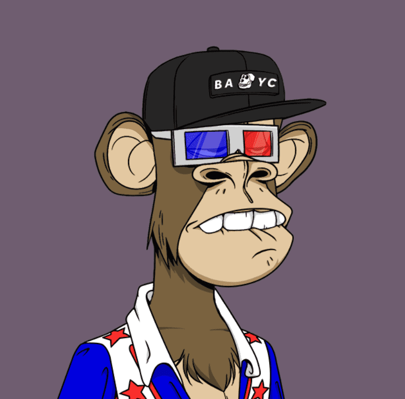

# Bored Ape Seeks Yacht Club #0

猿的起源故事官方收藏#5636。 这个系列记录了美洲猿寻找无聊猿游艇俱乐部的旅程。 不接受任何替代品。此 ERC-721 代币使持有者有权为我们即将推出的由 Riot Games 的高级故事板艺术家执导的动画 BASAC NFT 早期铸造。哦，是的，我们的 Web 开发人员在当时是一个 bboy。 他还是可以下来的。

Bored Ape Seeks Yacht Club #0 NFT 在过去 7 天内售出 26 次。Bored Ape Seeks Yacht Club #0 的总销售额为 759.45 美元。Bored Ape Seeks Yacht Club #0 NFT 的平均价格为 29.2 美元。有 1,236 名 Bored Ape Seeks Yacht Club #0 所有者，总共拥有 5,636 个代币。

