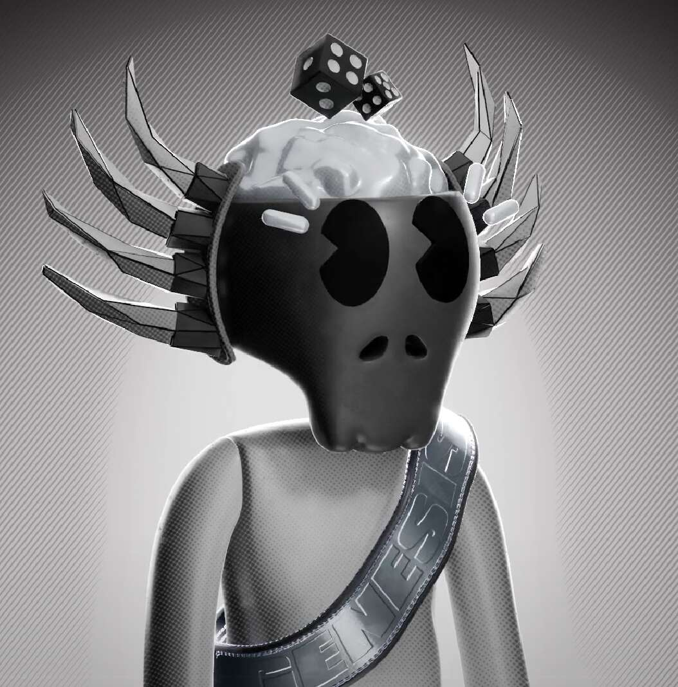

# Bored Bones Genesis

Genesis mint500 无聊骨头 0.1 ETH |世界标准时间 4 月 22 日晚上 10 点。售罄后 24-48 小时显示。
CharityBored Bones 1/1 慈善拍卖。
代币销售 48 小时后，BONE$ 代币开始生成。
BONE$ MarketplaceBONE$ Marketplace 上线，包括即将推出的项目的 WL 广告位、第二个系列的免费薄荷糖、定制的 Bored Bones 俱乐部雕像等等！
Multiplayer Bone RunMultiplayer 功能添加到 Bone Run。与其他人竞争，并为荣耀而冒险！
MerchMerch 设计投票+商品掉落（部分创世持有者将获得免费商品）。
交换工具现在，我们希望保持安静。这是一个巨大的发展，将在空间中产生影响。更多即将到来。
已编辑的空投我们将为无聊的骨头俱乐部持有者进行空投......但它会是什么？
无聊骨头俱乐部迷你系列我们将制作一个完整的无聊骨头俱乐部迷你系列，其中包括一群由社区投票选出的来自我们合作伙伴社区的角色。我们很高兴能进一步将无聊的骨头带入生活！
项目加速器计划受 Voltura 的 web3 加速器的启发，我们决定自掏腰包成立一个专项基金，用于支持有创新想法的创始人。社区需要共同努力以在这个领域成长，而不是互相把关。
MetaverseBored Bones Club 完全融入“死地$”。还有什么奥秘……

