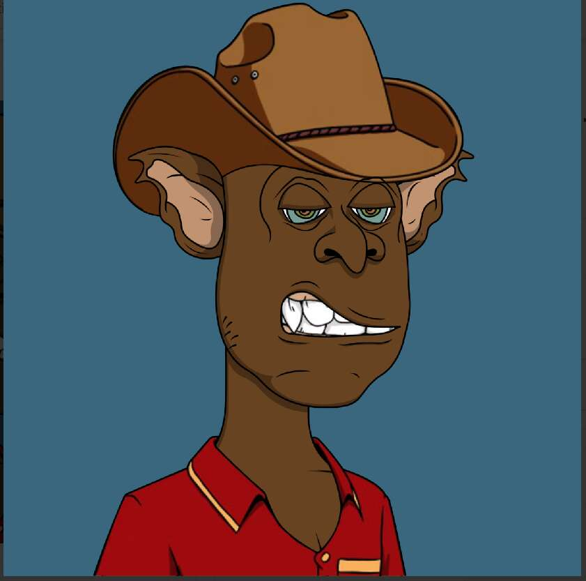

# Bored Goblin Yacht Club.wtf

哥布林又可爱又丑，但有时他们很无聊...、

无聊的妖精游艇俱乐部.wtf NFT - 常见问题（FAQ）
▶ 什么是无聊的妖精游艇俱乐部.wtf？
Bored Goblin Yacht Club.wtf 是一个 NFT（非同质代币）集合。存储在区块链上的数字艺术品集合。
▶ Bored Goblin Yacht Club.wtf 代币有多少？
总共有 5,555 个 Bored Goblin Yacht Club.wtf NFT。目前，1,712 位船主的钱包中至少有一个 Bored Goblin Yacht Club.wtf NTF。
▶ Bored Goblin Yacht Club.wtf 拍卖中最贵的是什么？
最昂贵的 Bored Goblin Yacht Club.wtf NFT 是 Bored Goblin Yacht Club #5014。它于 2022-06-04（3 个月前）以 18.2 美元的价格售出。
▶ 最近卖出了多少无聊的妖精游艇俱乐部.wtf？
过去 30 天内共售出 24 个 Bored Goblin Yacht Club.wtf NFT。
▶ Bored Goblin Yacht Club.wtf 需要多少钱？
过去 30 天，最便宜的 Bored Goblin Yacht Club.wtf NFT 销售额低于 0 美元，最高销售额超过 4 美元。在过去 30 天内，Bored Goblin Yacht Club.wtf NFT 的平均价格为 0 美元。
▶ 什么是流行的 Bored Goblin Yacht Club.wtf 替代品？
许多拥有 Bored Goblin Yacht Club.wtf NFT 的用户还拥有 trolltown.wtf、TOTO BY SNOBS、We The Kids 和 Elftown.wtf。

