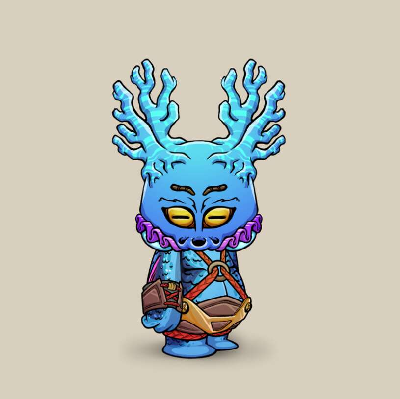

# Bored Koda Klub

9,854 个小生物！ 独特的 NFT 代币，图像可能受到现有艺术的启发！但与任何其他项目无关！ 我们是无聊的柯达俱乐部！！ 来访问我们的推特吧！

无聊的 Koda Klub NFT - 常见问题（FAQ）
▶ 什么是 Bored Koda Klub？
Bored Koda Klub 是一个 NFT（非同质代币）集合。 存储在区块链上的数字艺术品集合。
▶ 有多少 Bored Koda Klub 代币？
总共有 9,854 个 Bored Koda Klub NFT。 目前，2,026 位车主的钱包中至少有一个 Bored Koda Klub NTF。
▶ Bored Koda Klub 最昂贵的促销活动是什么？
出售的最昂贵的 Bored Koda Klub NFT 是 Kodas #9536。 它于 2022-06-18（3 个月前）以 87.8 美元的价格售出。
▶ 最近卖出了多少 Bored Koda Klub？
过去 30 天内售出了 148 个 Bored Koda Klub NFT。
▶ Bored Koda Klub 需要多少钱？
在过去 30 天里，Bored Koda Klub NFT 最便宜的销售额低于 2 美元，最高销售额超过 9 美元。 在过去 30 天内，Bored Koda Klub NFT 的中位价格为 4 美元。

