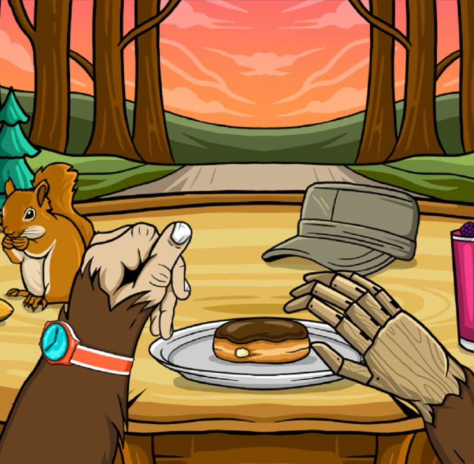

# Bored Breakfast Club

Bored Breakfast Club 由 5,000 个独特的早餐场景组成，以 NFT 形式存在于以太坊区块链上。 他们还授予您使用独家咖啡俱乐部的权限，该俱乐部从第三波烘焙商 Yes Plz 那里免费运送美味无比的咖啡。 每个 NFT 的大小都可以完美地适合您选择的社交网络中的横幅。 持有人还将受益于社区咖啡钱包，该钱包通过二级市场销售的特许权使用费和 Bored Breakfast 电子商务销售的部分利润为持续的咖啡运输提供资金。 本质上，Bored Breakfast Club 是 Web3 咖啡订阅服务。

