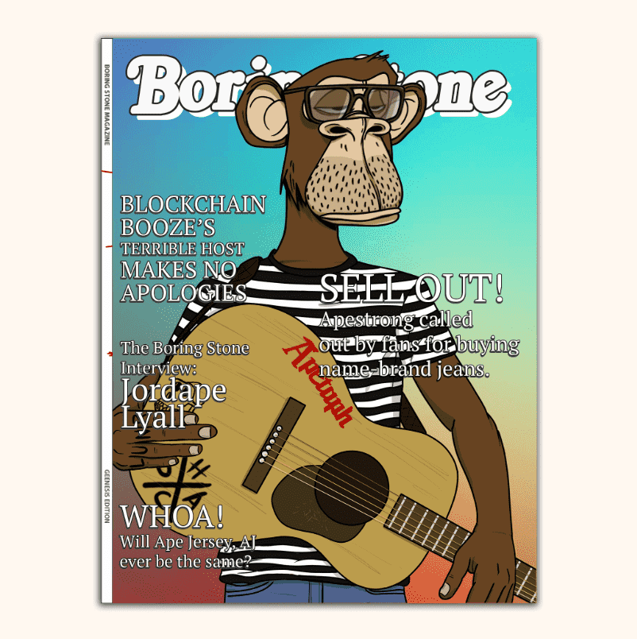

# BoringStone Genesis Collection

Boring Stone 是一个 NFT 项目，致力于为更广泛的 NFT 社区带来一些乐趣和享受。 Genesis 集合由 10,000 个随机生成的 NFT 组成，结合了 7 个特征类别和 200 多个单独的独特特征。 类别包括封面图片、背景、徽标、标题和一些复活节彩蛋，当它们组合在一起时，可以为 NFT 世界创造一种有趣且引人入胜的体验。这是 NFT.FAMILY 和 Blockchain & Booze 的第一款产品！NFT 杂志
纪念元宇宙中的主要故事，并将不同的项目和社区聚集在一起，带来有趣和引人入胜的体验。

