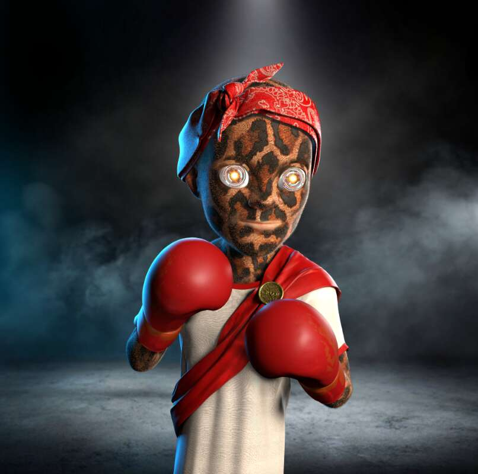

# Boxing Boyz Metaverse

Boxing Boyz 是一个 3D 动画 NFT 集合，包含 5,000 个独特的拳击角色和 150 种不同的元素。 我们通过玩赢游戏将真实的拳击世界与数字革命相结合。

Boxing Boyz Metaverse NFT - 常见问题（FAQ）
▶ 什么是拳击小子元宇宙？
Boxing Boyz Metaverse 是一个 NFT（不可替代令牌）集合。存储在区块链上的数字艺术品集合。
▶ 有多少 Boxing Boyz Metaverse 代币？
总共有 5,008 个 Boxing Boyz Metaverse NFT。目前，1,596 位所有者的钱包中至少有一个 Boxing Boyz Metaverse NTF。
▶ Boxing Boyz Metaverse 最昂贵的销售是什么？
售出的最昂贵的 Boxing Boyz Metaverse NFT 是 Your Collection #94。它于 2022 年 6 月 30 日（2 个月前）以 220 美元的价格售出。
▶ 最近卖出了多少 Boxing Boyz Metaverse？
过去 30 天内售出了 144 个 Boxing Boyz Metaverse NFT。
▶ Boxing Boyz Metaverse 需要多少钱？
过去 30 天，最便宜的 Boxing Boyz Metaverse NFT 销售额低于 140 美元，最高销售额超过 329 美元。过去 30 天 Boxing Boyz Metaverse NFT 的中位价格为 200 美元。
▶ 什么是流行的 Boxing Boyz Metaverse 替代品？
许多拥有 Boxing Boyz Metaverse NFT 的用户还拥有 Cool Dogs Official、MeebitApes、CharLi V3 和 Bored Ape x Louis Vuitton Original。

