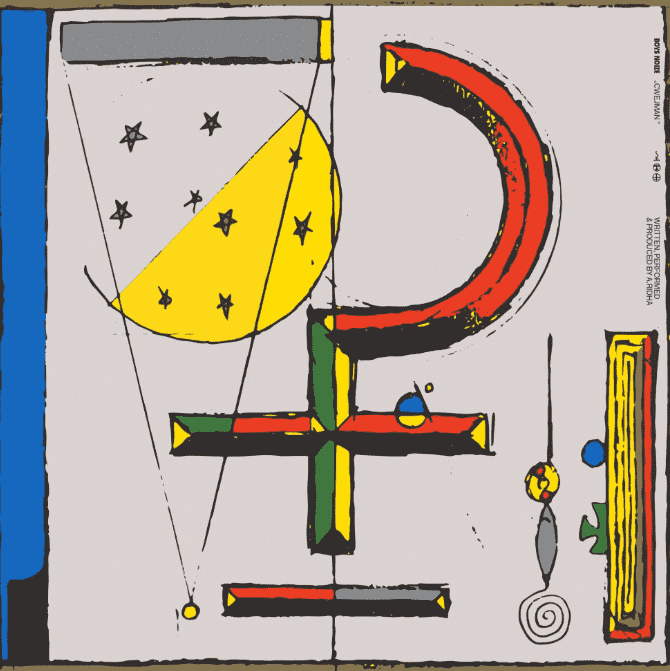

# Boys Noize on Sound.xyz

Boys Noize on Sound.xyz NFT 在过去 7 天内售出 4 次。Sound.xyz 上 Boys Noize 的总销售额为 604.89 美元。Sound.xyz NFT 上的 Boys Noize 的平均价格为 151.2 美元。Sound.xyz 上有 83 名 Boys Noize 的所有者，总共拥有 100 个代币。

Boys Noize on Sound.xyz NFT - 常见问题（FAQ）
▶ Sound.xyz 上的男孩噪音是什么？
Sound.xyz 上的 Boys Noize 是一个 NFT（不可替代令牌）集合。存储在区块链上的数字艺术品集合。
▶ Sound.xyz 代币上有多少 Boys Noize？
Sound.xyz NFT 上总共有 100 个 Boys Noize。目前，83 位所有者的钱包中至少有一个 Boys Noize on Sound.xyz NTF。
▶ Sound.xyz 销售中最贵的 Boys Noize 是什么？
Sound.xyz NFT 上最昂贵的 Boys Noize 是 Cwejman #78。它于 2022 年 7 月 2 日（2 个月前）以 164.7 美元的价格售出。
▶ Sound.xyz 上的 Boys Noize 最近卖出了多少？
在过去 30 天内，Sound.xyz NFT 上的 Boys Noize 共售出 8 个。
▶ Sound.xyz 上流行的 Boys Noize 替代品有哪些？
许多在 Sound.xyz NFT 上拥有 Boys Noize 的用户也拥有 slenderbody， DLG。, 在 Sound.xyz和 KILO KISH 上的 TOKiMONSTA。

