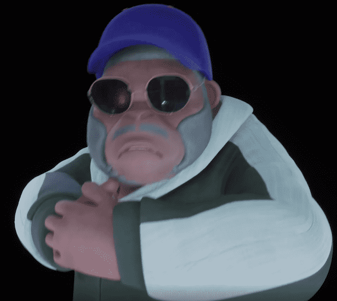

# Brave Kongz

我们将通过将韩国流行文化融入可爱的 Meta Kongz
中，向世界介绍韩国音乐和舞蹈 。
Meta Kongz遇到了代表韩国的代表K-pop制作人Brave Brothers，并获得了重生。'Brave Kongz'是一个NFT（PFP）项目， Meta Kongz将在Brave Entertainment的负责人Brave Brothers的制作下作为嘻哈歌手出道 。 负责制作这个项目的勇敢兄弟是 K-pop 的领先制作人和 K-culture 的先驱。 作为在去年获得“2021亚洲艺人大奖最佳创作者奖”的顶级制作人，我很期待勇敢的兄弟制作的Meta Kongz将如何通过实践过程。 NFT 是一种“不可替代的代币”。Brave Brothers 希望通过这个项目将 K-POP 文化推广到区块链和元界世界，并在未来重振 BMP 币生态系统。 此外，我们计划不仅在现实世界而且在加密阶段积极作为顶级制作人，向全球 NFT 世界扩张。

