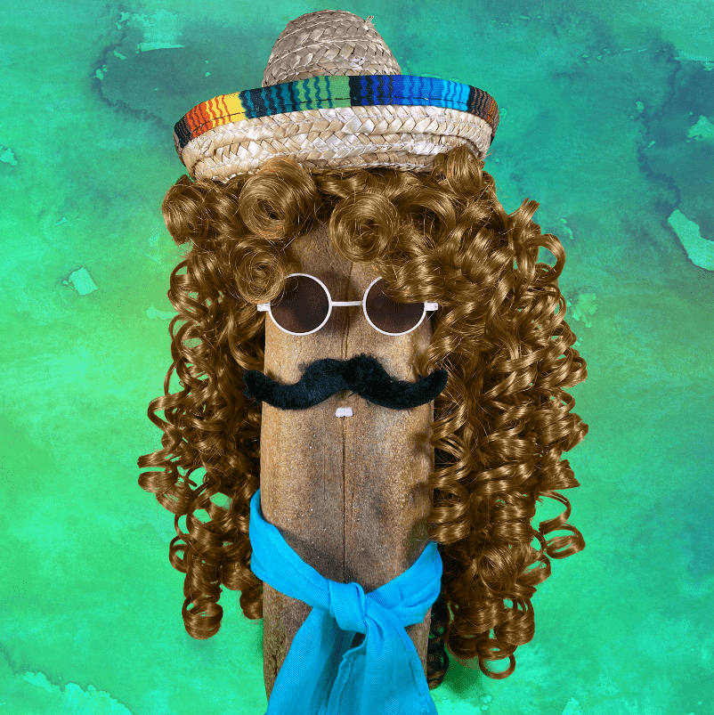

# Bread Heads

经常问的问题那么什么是面包头呢？为什么选择索拉纳？你验证了吗？

这个系列有多少个，有元数据吗？价格是多少，有版税吗？你打算对你之前的 2 系列做点什么吗？

面包头 NFT - 常见问题 (FAQ)
▶ 什么是面包头？
Bread Heads 是一个 NFT（不可替代代币）集合。存储在区块链上的数字艺术品集合。
▶ 存在多少个面包头代币？
总共有 500 个 Bread Heads NFT。目前，237 位业主的钱包中至少有一个 Bread Heads NTF。
▶ 什么是最昂贵的面包头销售？
出售的最昂贵的 Bread Heads NFT 是 Bread Head #341。它于 2022-08-09（25 天前）以 71.8 美元的价格售出。
▶ 最近卖了多少个面包头？
过去 30 天内售出了 2 个 Bread Heads NFT。
▶ 什么是流行的面包头替代品？
许多拥有 Bread Heads NFT 的用户还拥有 We Stand Against Evil、 Pumpametti、 CryptoPunks Alive和 ASTARiSK。

