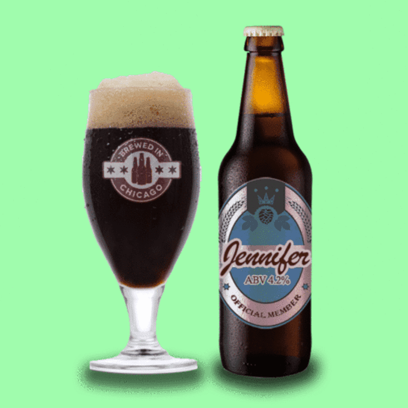

# Brewed in Chicago

该系列包括 999 个个性化啤酒瓶。 您可以轻松搜索常见的名字并找到多个 NFT 可供选择。 或者寻找那些叫做“啤酒”或“干杯”的。 所有权使您可以访问我们的在线社区以及现场精酿啤酒活动。 我们起源于芝加哥，在那里您可以找到美国最好的啤酒厂。

在芝加哥酿造 NFT - 常见问题（FAQ）
▶ 什么是芝加哥啤酒？
Brewed in Chicago 是一个 NFT（不可替代代币）系列。存储在区块链上的数字艺术品集合。
▶ 存在多少 Brewed in Chicago 代币？
芝加哥 NFT 总共有 999 个 Brewed。目前，26 位业主的钱包中至少有一款 Brewed in Chicago NTF。
▶ 最近卖出了多少 Brewed in Chicago？
过去 30 天内售出 0 个 Brewed in Chicago NFT。

