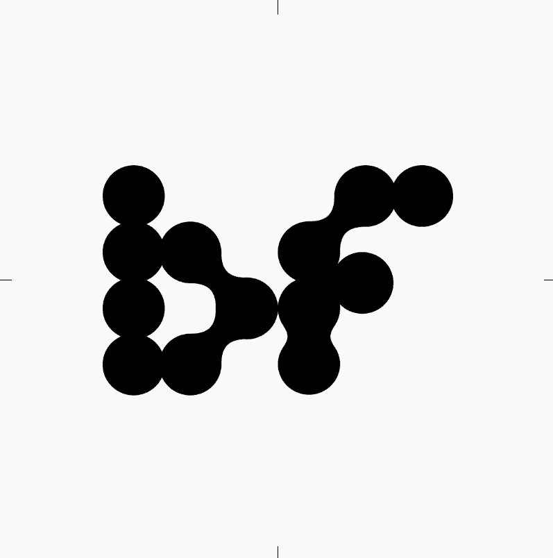

# Bridges by Oshi

Oshi NFT 的 Bridges 在过去 7 天内售出 2 次。Bridges by Oshi 的总销售额为 105.45 美元。Oshi NFT 的一个 Bridges 的平均价格为 52.7 美元。Oshi 拥有者共有 312 座 Bridges，总共拥有 900 个代币。

Oshi 与 Beat Foundry 合作的第一个生成系列。用链上歌词击败 Foundry 的第一个系列。

Oshi NFT 的桥梁 - 常见问题（FAQ）
▶ Oshi 的 Bridges 是什么？
Bridges by Oshi 是一个 NFT（不可替代代币）集合。存储在区块链上的数字艺术品集合。
▶ Oshi 代币有多少个 Bridges？
Oshi NFT 总共有 900 座桥梁。目前，312 位车主的钱包中至少有一个 Oshi NTF 的 Bridges。
▶ Oshi 出售的最昂贵的 Bridges 是什么？
Oshi NFT 出售的最昂贵的 Bridges 是 Bridge #735。它于 2022-06-07（3 个月前）以 143.3 美元的价格售出。
▶ Oshi 最近卖出了多少台 Bridges？
在过去 30 天内，Oshi NFT 共售出 6 个 Bridges。
▶ Oshi 有哪些流行的 Bridges 替代品？
许多拥有 Oshi NFT 的 Bridges 的用户还拥有 陶笛、 声音 xyz 上的花粉、 Sound.xyz 上的清晰眼睛和 血腥白色。

