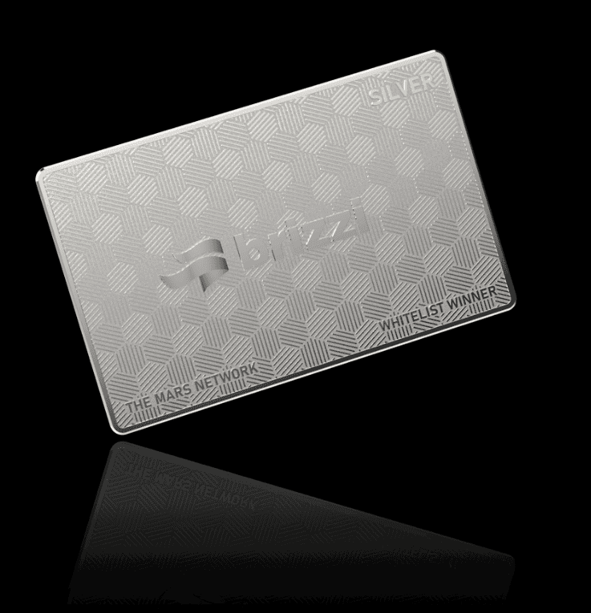

# Brizzi PASS

▶ 什么是 Brizzi PASS？
Brizzi PASS 是一个 NFT（非同质代币）集合。 存储在区块链上的数字艺术品集合。
▶ 有多少 Brizzi PASS 代币？
总共有 2 个 Brizzi PASS NFT。 目前，2,328 位车主的钱包中至少有一个 Brizzi PASS NTF。
▶ Brizzi PASS 最贵的促销是什么？
最昂贵的 Brizzi PASS NFT 是 brizzi Silver Pass。 它于 2022-06-04（3 个月前）以 980.7 美元的价格售出。
▶ 最近卖出了多少张Brizzi PASS？
过去 30 天内售出了 115 个 Brizzi PASS NFT。
▶ Brizzi PASS 的费用是多少？
在过去 30 天内，最便宜的 Brizzi PASS NFT 销售额低于 5 美元，最高销售额超过 31 美元。 在过去 30 天内，Brizzi PASS NFT 的中位价格为 17 美元。
▶ 有哪些流行的 Brizzi PASS 替代品？
许多拥有 Brizzi PASS NFT 的用户还拥有 The Martians：Metaverse、MetaBowwow、KPOPCTzen_V2_Official 和 Ark Mates。

