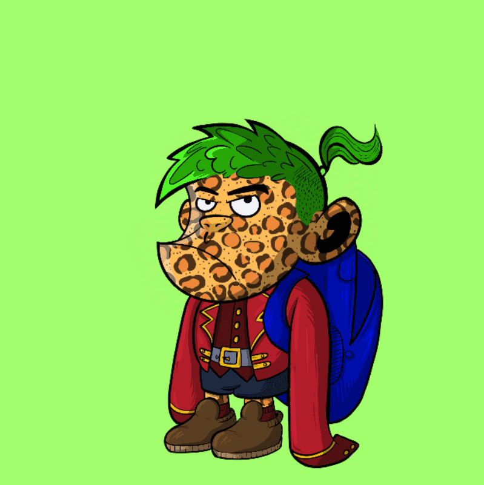

# BrokeBoyz

BrokeBoyz NFT 在过去 7 天内售出 4 次。BrokeBoyz 的总销售额为 258.87 美元。一个 BrokeBoyz NFT 的平均价格为 64.7 美元。共有 1,746 名 BrokeBoyz 所有者，总共拥有 6,259 个代币。

BrokeBoyz 是基于 BrokeBoyz 动画系列的生成集合

和 PvP 格斗游戏；BrokeBoyzBrawl。

BrokeBoyz Go Meta

BrokeBoyz NFT 已售罄，现在仅在 Opensea 和 LooksRare 等二级市场上可用。B-Block、Tess、Roosevelt 和 BigBoy B-Block 是 BrokeBoyz 的主要角色。他们出现在动画系列和今年晚些时候推出的 BrokeBoyz Brawl 游戏中。

确保加入我们的 discord，因为我们几乎每天都有项目更新，并确保您在 twitter 空间上看到我们每周的街角 ama。

BrokeBoyz 是一种生活方式，一种堕落的生活方式，所以本着完全无耻的方式，我们想介绍一下BrokeBoyz。

BrokeBoyz NFT - 常见问题（FAQ）
▶ 什么是 BrokeBoyz？
BrokeBoyz 是一个 NFT（非同质代币）集合。存储在区块链上的数字艺术品集合。
▶ 有多少 BrokeBoyz 代币？
总共有 6,259 个 BrokeBoyz NFT。目前，1,746 位车主的钱包中至少有一个 BrokeBoyz NTF。
▶ 什么是最昂贵的 BrokeBoyz 销售？
售出的最昂贵的 BrokeBoyz NFT 是 B-Block #579。它于 2022 年 8 月 28 日（5 天前）以 112.6 美元的价格售出。
▶ 最近卖出了多少 BrokeBoyz？
过去 30 天内售出了 11 个 BrokeBoyz NFT。
▶ BrokeBoyz 的价格是多少？
在过去 30 天里，BrokeBoyz NFT 最便宜的销售额低于 14 美元，最高销售额超过 113 美元。过去 30 天内，BrokeBoyz NFT 的中位价格为 23 美元。
▶ 什么是流行的 BrokeBoyz 替代品？
许多拥有 BrokeBoyz NFT 的用户还拥有 Milan Quadens 、 PotatoPunks、 BLANK Humanity Initializers和 Ghost Frens Collection的“LOVE”。

