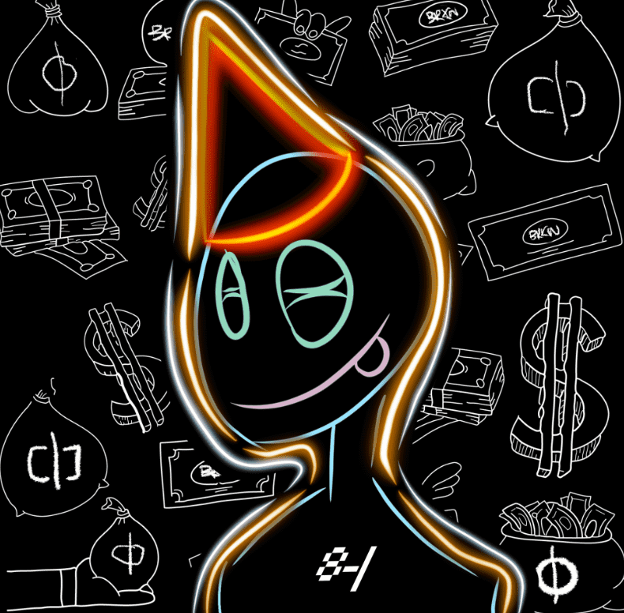

# BrokenClub

BrokenClub 是一个独家的下班后俱乐部和品牌 IRL 和元界，在以太坊区块链上收集了 3000 个独特的 NFT。BrokenClub 还在打造一个奢侈街头时尚生活方式服装品牌，该品牌也将在 IRL 和 metaverse 中销售。每个 NFT 都会生成 $BRKN，这是为 BrokenClub 生态系统提供动力的 ERC-20 代币。

BrokenClub NFT - 常见问题（FAQ）
▶ 什么是 BrokenClub？
BrokenClub 是一个 NFT（非同质代币）集合。存储在区块链上的数字艺术品集合。
▶ 有多少 BrokenClub 代币？
总共有 3,000 个 BrokenClub NFT。目前，690 位所有者的钱包中至少有一个 BrokenClub NTF。
▶ 最近卖出了多少 BrokenClub？
过去 30 天内售出 0 个 BrokenClub NFT。
▶ 什么是流行的 BrokenClub 替代品？
许多拥有 BrokenClub NFT 的用户还拥有 BrokenSeaDAO、 EL NUMEROS、 DegenOkayBears和 WaterBe4nZuki。

