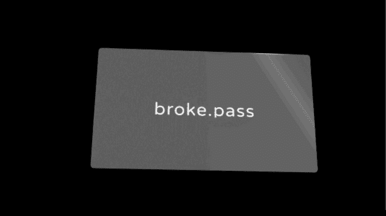

# broke.pass

▶ 什么是break.pass？
break.pass 是一个 NFT（非同质代币）集合。 存储在区块链上的数字艺术品集合。
▶ 有多少个broken.pass 代币？
总共有 962 个break.pass NFT。 目前 870 位所有者的钱包中至少有一个 break.pass NTF。
▶ 最昂贵的break.pass 销售是什么？
卖出的最昂贵的broken.pass NFT是break.pass。 它于 2022-06-18（2 个月前）以 54.9 美元的价格售出。
▶ 最近卖出了多少个break.pass？
过去 30 天内售出了 150 个break.pass NFT。
▶break.pass 的费用是多少？
在过去 30 天内，最便宜的 break.pass NFT 销售额低于 10 美元，最高销售额超过 26 美元。 在过去 30 天内，break.pass NFT 的中位价格为 17 美元。
▶ 流行的 break.pass 替代品有哪些？
许多拥有break.pass NFTs的用户还拥有DaPunk、AI HUMANS COLLECTION、2Bits和break.boys。

