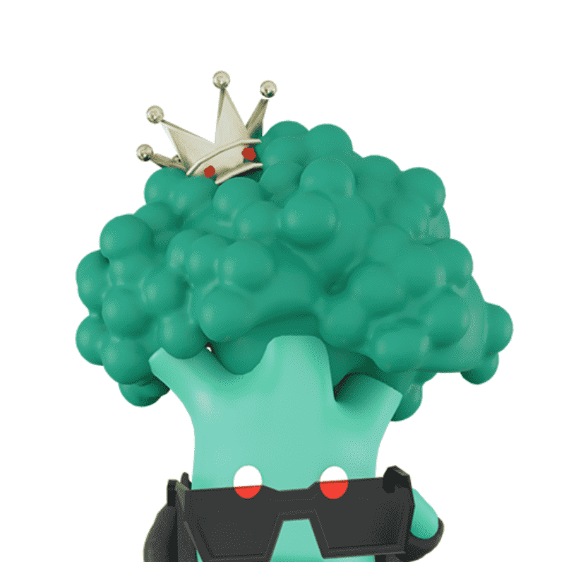

# Brokoli Collectibles

赚取元宇宙的工厂：积极的气候行动 = 真正的盈利潜力
使用我们的绿色产品抵消您的链上碳足迹，赚取 $SEED。

种植 $SEED 以在您的个人仪表板上种植 NFTrees，在公开市场上出售 NFTrees 或使用它们在我们的绿色元宇宙中种植您的土地资产。

在您的土地上出租、做广告和建造以赚取 $BRKL。 您种植的 NFTrees 越多，您必须从中赚取的土地面积就越多。

您的贸易种树，无需额外费用
我们的 Green DEX 聚合器为您提供市场上最优惠的交易价格。 相同的费用，除了 Brokoli，他们去这个星球。

