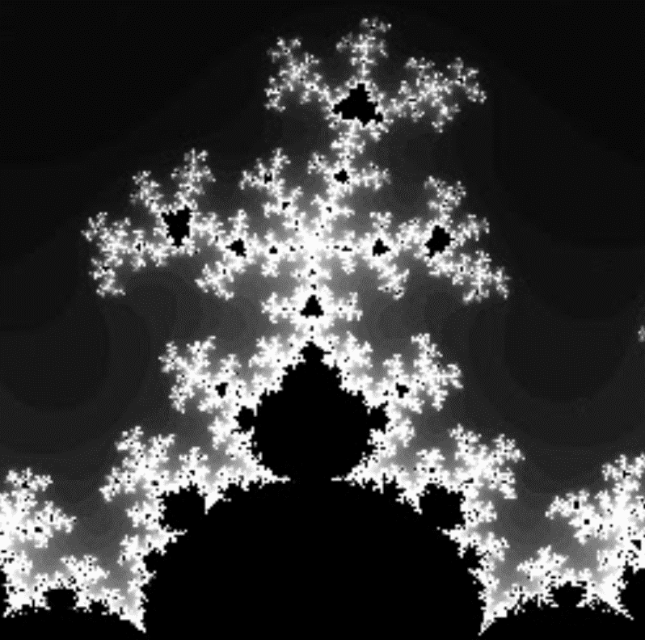

# Brotchain

Brotchain 是生成式 NFT 艺术，其位图完全由区块链合约生成和渲染。这几乎与 NFT 一样纯粹：没有输入，没有外部性，没有渲染依赖，只有 100% 的 Solidity。

Brots 由Mandelbrot和相关 的Mandelbar、Multibrot和Burning Ship生成 分形。我们使用手工制作的 EVM 组件（即操作 0 和 1）来计算每个像素的“逃逸时间”值。这是相当简单的数学运算，但在一种甚至不处理小数点的语言中却极其困难。结果值被映射到一个可定制的调色板——以一种任何人都可以添加自己的印记的方式创建下面看到的可识别图案。

有 512 个 NFT（“Brots”）可用，每个都是 8 个系列之一的一个版本（即每个 64 个）。每个系列要么是一个完整的分形，跨越其可能的像素的全部范围，要么是一个选择的缩放区域，以展示可以生成的令人难以置信的图案和形状的多样性。

