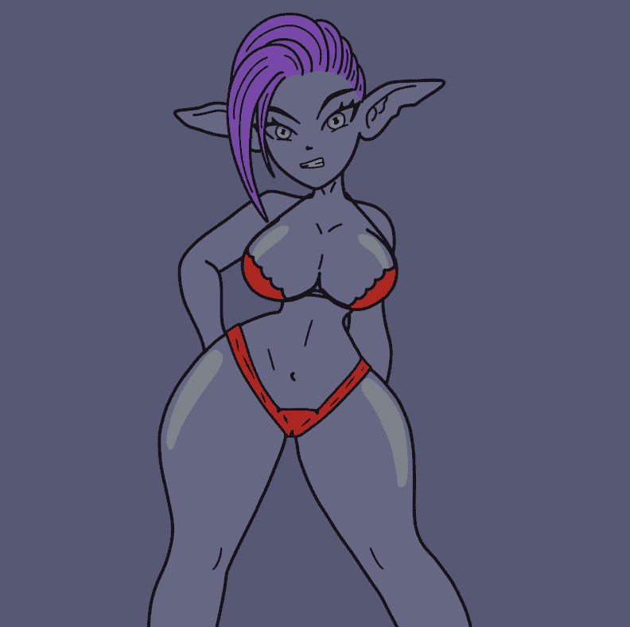

# Btch Town Official

Btch Town 官方 NFT 在过去 7 天内售出 1019 次。Btch Town Official 的总销售额为 $4.39k。一枚 Btch Town Official NFT 的平均价格为 4.3 美元。Btch Town官方拥有者682人，总供应量3980枚。

7000 Freemint Stripper btches 在区块链 Mint 在 Twitter 上关注我们

Btch Town 官方 NFT - 常见问题（FAQ）
▶ 什么是Btch Town官？
Btch Town Official 是一个 NFT（Non-fungible token）集合。存储在区块链上的数字艺术品集合。
▶ Btch Town 官方代币有多少？
总共有 3,980 个 Btch Town 官方 NFT。目前 682 位车主的钱包中至少有一个 Btch Town Official NTF。
▶ Btch Town Official Sale 最贵的是什么？
最贵的 Btch Town Official NFT 是 Btch#1309。它于 2022-07-03（2 个月前）以 65.8 美元的价格售出。
▶ 最近卖了多少Btch Town Official？
过去 30 天内共售出 1,019 个 Btch Town 官方 NFT。
▶ Btch Town 官员的费用是多少？
过去 30 天，最便宜的 Btch Town 官方 NFT 销售额低于 2 美元，最高销售额超过 5 美元。过去 30 天内，Btch Town Official NFT 的中位价格为 3 美元。
▶ 什么是流行的 Btch Town Official 替代品？
许多拥有 Btch Town Official NFT 的用户还拥有 MoonNecks NFT、 Warlox NFT Official、 Boners NFT和 AlphaCats Official。

