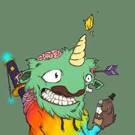

# Bufficorn Buidl Brigade V2

**布菲角的传说**

独角兽可能很好地代表了 VC 社区的稀有性和价值，但它并不能很好地代表 Web3 的精神。毕竟，最后一次有人看到独角兽和其他独角兽（或任何其他动物）是什么时候？绝不。问题是独角兽是一个孤独的生物，独自沉浸在它的神秘之中。

然后是水牛，一种与社区一起奔跑的群体动物，但它并不以魔法或威严着称。

传说]几个世纪前，为了解决独角兽和水牛之间的争端，缔结了一项条约，以创造一种新的以社区为导向的神奇动物：水牛。

Bufficorn (monocerus magicis bisonae) 描绘了两全其美的人格特质。他们#BUIDL 为正和结果，并鼓励社区的每个成员表达独特的创造力。

Bufficorn  BUIDL Brigade 表达了“成为 Bufficorn”以及对BUIDLing 去中心化未来充满热情的意义

