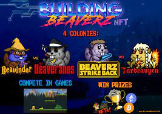

# Building Beaverz Official

# 什么是建筑比弗兹？

**受**团队运动和一些我们最喜欢的游戏化 NFT 项目的启发，我们寻求将两者结合起来，并诞生了“T *eam-Fi”* 。我们认为引入团队合作会为已经很有趣的派对增添一层额外的兴奋感。毕竟，谁不喜欢和朋友一起赢呢？？与其每个人为自己，自己玩，不如与你的殖民地分享荣耀？在 Building Beaverz 中，NFT 持有者可以一起建设，一起制定战略并互相鼓励，因为你与你的殖民地一起赢得终极建筑锦标赛 (UBC)！我们走吧！！！

**Building Beaverz的总供应量为**10,000 个**，**每间房屋 2,500 个**。在建造 Beaverz 铸币厂一周后，比赛开始了。这一周**的“赛前”时期将允许人们在比赛开始时组织到他们希望进入的房子里。*愿赔率永远对您选择的殖民地有利！ Building Beaverz 的供应量将从游戏 1 的 2,000 个开始（每个殖民地 500 个），并将随着游戏的进展和生态系统的扩展而增加，直到达到 10,000 个最大供应量。

