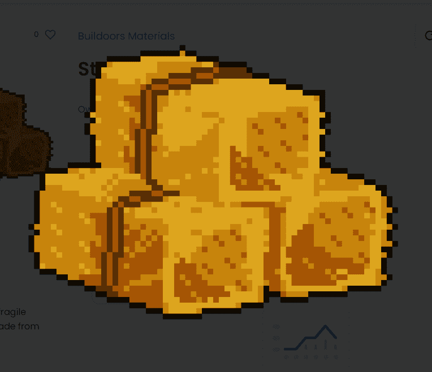

# Buildoors Materials

Buildoors是一个免费的薄荷实验，具有优化的、节省气体的合同。存在 999 个材料 NFT，如果组合正确，可以创建 333 个房屋。将必要的材料放在一起建造您未来的家，与他人合作或访问 OpenSea...

Buildoors Materials NFT 在过去 7 天内售出 4 次。Buildoors Materials 的总销售额为 0 美元。一份 Buildoors Materials NFT 的平均价格为 0 美元。有 288 位 Buildoors Materials 所有者，总共拥有 939 个代币。

建筑材料 NFT - 常见问题 (FAQ)
▶ 什么是建筑材料？
Buildoors Materials 是一个 NFT（不可替代代币）集合。存储在区块链上的数字艺术品集合。
▶ 有多少 Buildoors Materials 代币？
总共有 939 个 Buildoors Materials NFT。目前，288 位业主的钱包中至少有一个 Buildoors Materials NTF。
▶ 最昂贵的建筑材料销售是什么？
最昂贵的 Buildoors Materials NFT 是 Dirt #257。它于 2022 年 7 月 2 日（2 个月前）以 0 美元的价格出售。
▶ 最近卖出了多少 Buildoors Materials？
过去 30 天内共售出 4 个 Buildoors Materials NFT。

