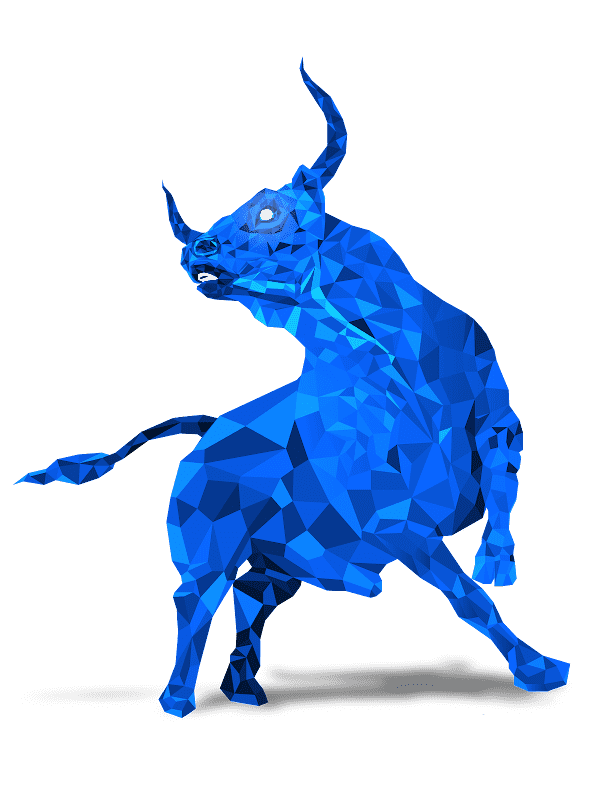

# Polygon Bull Fight

项目网站、社交联系方式、项目介绍内容详见：https://opensea.io/collection/bull-for-fight

.png)

准备好与你的公牛一起参加 Metaverse 中世界上第一个基于区块链的斗牛游戏。

##### ▶ 什么是多边形公牛？

Polygon Bull 是一个 NFT（不可替代代币）集合。存储在区块链上的数字艺术品集合。

##### ▶ 有多少个 Polygon Bull 代币？

总共有 8,000 个 Polygon Bull NFT。目前，15 位所有者的钱包中至少有一个 Polygon Bull NTF。

##### ▶ 最近卖出了多少 Polygon Bull？

过去 30 天内售出 0 个 Polygon Bull NFT。

截止至8月28日

8.0K**项目**

15**拥有者**

0.10**总容积**

<0.01**底价**
