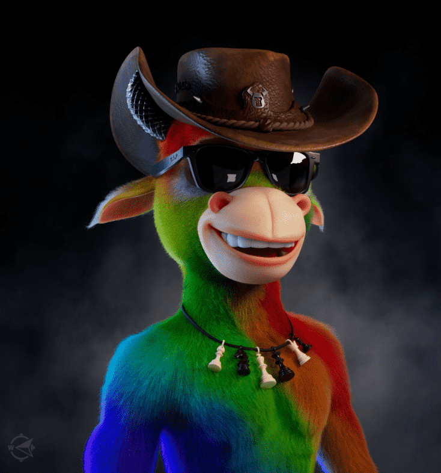

# Bulls and Apes Project - Teen Bulls

通过将同一公会的两只公牛的 DNA 合并到高度先进的孵化器中，公牛能够繁衍和扩展他们的文明，欢迎少年公牛来到他们的世界。 它们更高、更有活力且高度不可预测。Teen Bulls 可用于在 B.A.P 生态系统中生成 Merger Orbs 和 God Bulls。 了解更多关于 https://www.BullsAndApesProject.com 在 https://opensea.io/collection/bullsandapes-genesis 上探索我们的 Genesis 系列在 https://opensea.io/collection/bullsandapes-utilities 上探索我们的实用工具系列

关于
Bulls & Apes 项目
Bulls and Apes Project (BAP) 是一个生成式 3D NFT 项目，旨在通过为 NFT 收集者的期望和需求设定新标准来改变行业。 

我们首先为您降低 NFT 购买体验的风险。我们支持我们的产品，并将通过内置于智能合约中的改变行业的6 个月 ETH-Back Guarantee来支持它们。由于我们的项目由我们的创始人全额资助，我们可以锁定铸币厂收益，直到我们知道您对拥有我们的产品感到兴奋。

接下来，我们有一个完全成熟的创始人团队，拥有令人难以置信的成功记录。我们通过对我们的 NFT 进行代币化来加倍下注，这样您只需将它们放在钱包中即可获得独家代币，用于新铸币厂、IRL 活动的通行证以及未来的元界购买。

我们正在制作精湛的艺术作品，我们希望每个人都乐于展示他们的头像。

成功而精明的创始人，出色的艺术，以坚如磐石的6 个月 ETH 返还保证为后盾——这是我们认为 NFT 收藏家应该期待的。 

