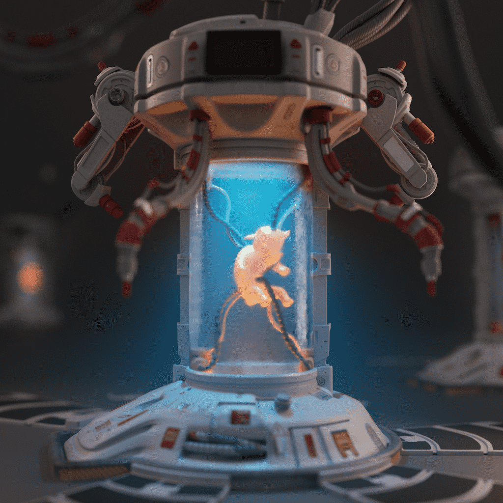

# Bulls and Apes Project - Utilities

作为 Bulls & Apes 项目的游戏化和代币经济学的一部分，该系列以孵化器和合并球为特色。 B.A.P. 使用培养箱。 游戏来铸造全新的 Teen Bull NFT。 合并球可用于在 B.A.P 生态系统中召唤神牛 NFT。 

Bulls and Apes Project（B.A.P.）是一个生成式3D NFT项目，旨在通过为NFT收集器的期望和需求设定新标准来改变行业。我们从为您降低NFT购买体验的风险开始。我们支持我们的产品，并将通过智能合约中内置的改变行业的6个月ETH-Back保证来支持它们。由于我们的项目完全由我们的创始人资助，我们可以锁定造币厂的收益，直到我们知道您很高兴拥有我们的产品。接下来，我们有一个完全由创始人组成的团队，他们有着令人难以置信的成功记录。我们通过标记我们的NFT来加倍努力，这样您只需将它们保存在钱包中即可获得独家代币，用于新造币厂，IRL活动的通行证以及未来的元界购买。我们正在制作精湛的艺术，我们希望每个人都能很高兴地展示他们的个人资料照片。成功和兴奋的创始人，梦幻般的艺术，以坚如磐石的6个月ETH-Back保证为后盾 - 这是我们认为NFT收藏家应该期待的。不要指望这个 - 要求它！

