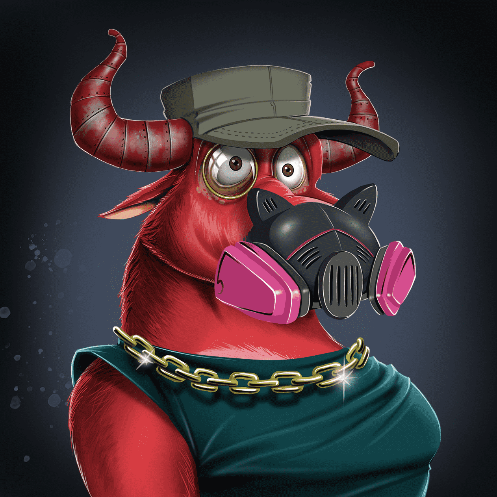

# BullsOnTheBlock Evo

BullsOnTheBlock 于 2021 年 10 月 15 日进化。OG Bulls 可以拱形以进化原始公牛的艺术。 在以下位置查看姐妹系列： BullsOnTheBlock | BearsOnTheBlockOWNER COUNT：OpenSea 显示的所有者数量具有误导性，因为超过 1.9K 人已经进化了他们的 Bull。 通过进化你的公牛，你会将你的原始公牛转移到金库，这个金库目前拥有超过 6.3K 的原始公牛。 任何一个 Bull NFT 的所有权目前都授予两个 Bull Collection NFT 的所有权。 

多头相信区块链。
我们是一个由志同道合的人组成的社区，他们团结一致，创造了一个巨大的多元宇宙品牌。
10，000 个 Bull 头像的集合，代表我们每个人和我们对 Web3 的热爱。

您的公牛NFT是您在Block的会员资格，您可以在其中访问独家NFT掉落，街头服装商品，我们庞大的沙盒元世界以及更多随时间推移而揭示的内容！

