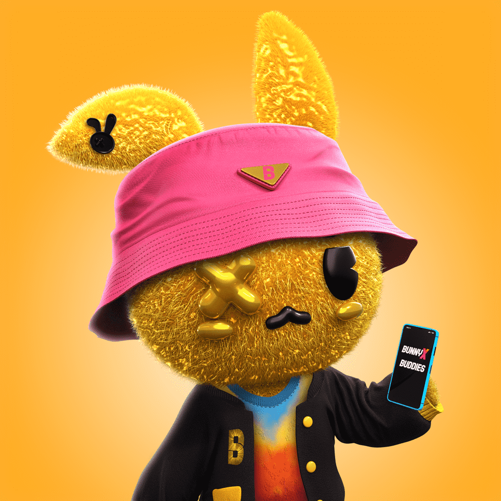

# Bunny Buddies

Bunny Buddies 是 8888 只手绘兔子的集合，它们在以太坊区块链上过着最美好的生活。 由 Ryan Robinson 设计，这些具有疯狂美学和强烈个性的 NFT 正在接管元界。

Bunny Buddies是8888只手绘兔子的集合，在以太坊区块链上过着最好的生活。由Ryan Robinson设计，这些具有疯狂美学和强烈个性的NFT正在接管元宇宙。

Bunny Buddies是一系列独特的收藏品，由Ryan Robinson（又名Rhabbitz）设计，来自Yobritish艺术家团体。通过这个系列，与环球音乐，哥伦比亚唱片公司或大西洋唱片公司等主要唱片公司合作的艺术家探索了二元性，并在黑暗和光明之间寻找适当的平衡。“这件艺术品代表了我的品牌。从表面上看，你会看到可爱，但当你潜入它并看到进一步的背景时，我可能会添加更黑暗的元素，比如说唱音乐，“罗宾逊说。你可能已经看过他的作品，现在是你第一次有机会拥有它。

