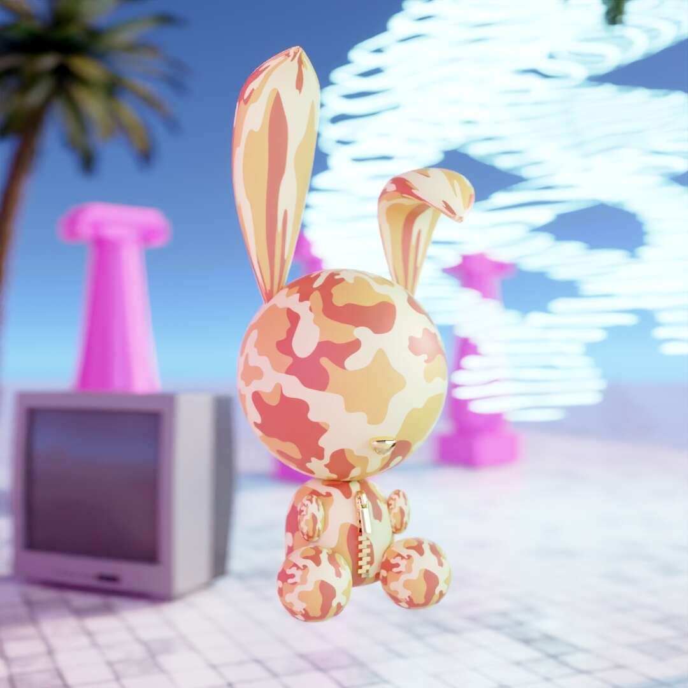

# BUNS.LAND Genesis

250 年中的 1 日，Genesis 是一个时尚宣言，因为该系列是在第一场 buns 数字时装秀之后推出的，并与 No More Mondays 和 Angelo Yoto 合作创建。每个 bun 所有者都将能够访问即将到来的 Next Decade App alpha。 该应用程序是将 NFT 聚集在一起的理想场所，无论它们来自何处，并随时随地展示您的收藏。 查看我们在 Discord 上的路线图，了解有关该应用程序的更多信息。

包子有朋友，很多朋友：Origin，Genesis，Burbur，Elfree和Olympus。他们总是想交更多的朋友。Next Decade，Buns.land背后的公司希望帮助Buns实现他们的目标，并正在开发一个应用程序，允许NFT收集器在一个地方拥有NFT，Next Decade应用程序。让我们养成包子家族吧！

