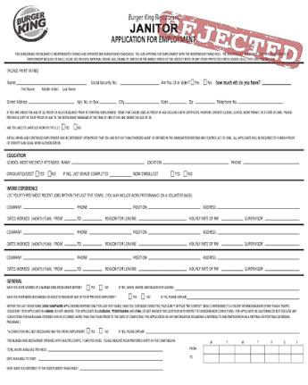

# Burger King Application

1111 burger king 应用程序，我们都可能需要，因为 eth 继续它的潜水。 前 555 个免费，接下来 555 个 0.01

.png)

##### ▶ 什么是汉堡王应用程序？

汉堡王应用程序是一个 NFT（不可替代令牌）集合。存储在区块链上的数字艺术品集合。

##### ▶ 汉堡王应用代币有多少？

总共有 587 个汉堡王应用 NFT。目前，56 位业主的钱包中至少有一个汉堡王应用程序 NTF。

##### ▶ 最近卖出了多少汉堡王应用程序？

过去 30 天内共售出 0 个 Burger King Application NFT。

截止至8月28日

587**项目**

56**拥有者**

0.04**总容积**
