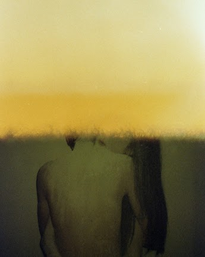

# BURN/

拥有者可以“烧掉”他们的代币并展示一张新的、随机生成的 1/1 化学烧伤胶片照片。

要做到这一点，所有所有者必须做的就是将 OpenSea 链接发送到他们的代币，并在他们的推文中包含“BURN ME”字样。业主只能这样做一次。

然后，创建者 (@gmdanny) 将支付汽油费，以在其位置显示新令牌和新元数据。这种转变可能会立即发生，可能需要几个小时。

##### ▶ 什么是烧伤/？

BURN/ 是一个 NFT（不可替代代币）集合。存储在区块链上的数字艺术品集合。

##### ▶ BURN/代币有多少？

总共有 20 个 BURN/NFT。目前 11 位所有者的钱包中至少有一个 BURN/NTF。
