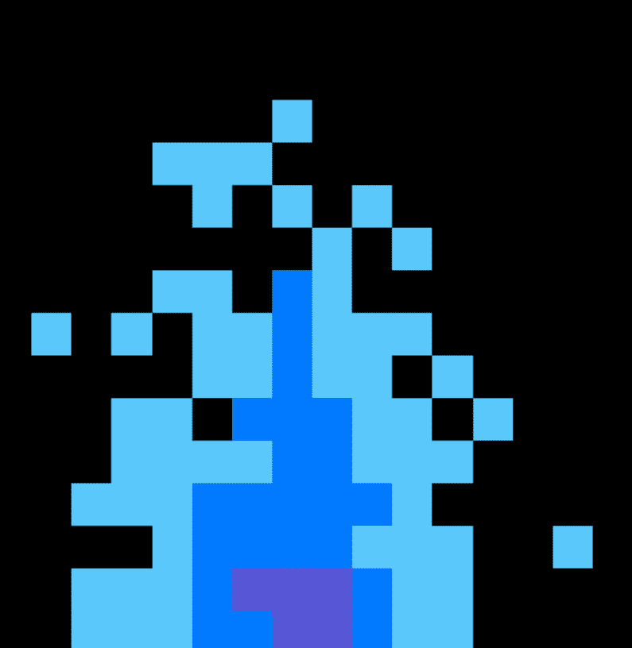

# Burnables NFT

有史以来第一个可退还的 NFT。 代币的所有者可以随时销毁他们的 NFT，并将原始铸币价格发送到他们的钱包。

此不可替代的令牌集合适用于18岁以上或您所在司法管辖区的法定年龄的个人;以较大者为准。

Burnables NFT是在以太坊网络上运行的NFT令牌的数字集合。该网站是一个允许参与者购买数字收藏品的界面。用户对自己的私人钱包的安全和管理负全部责任。用户必须在批准之前验证本网站生成的所有交易和合同。Burnables NFT智能合约在以太坊网络上运行;无法撤消、撤消或还原任何事务。本网站，以太坊合同及其连接服务“按原样”和“可用”提供，不提供任何形式的保证。使用本网站即表示您接受涉及我们收藏品的任何和所有交易的唯一责任。

不可替代的代币不是投资。Burnables NFT只是以太坊网络上的收藏品，应该这样对待。虽然我们希望继续我们的项目，发展这个社区，并增加效用;我们不保证未来的发展。您（所有者）同意您购买我们的不可替代令牌，就像收藏品一样。我们不承诺或担保这个不可替代的代币在未来会有任何价值。您，所有者，明白它们没有固有的货币价值，它们应该被视为收藏品。

