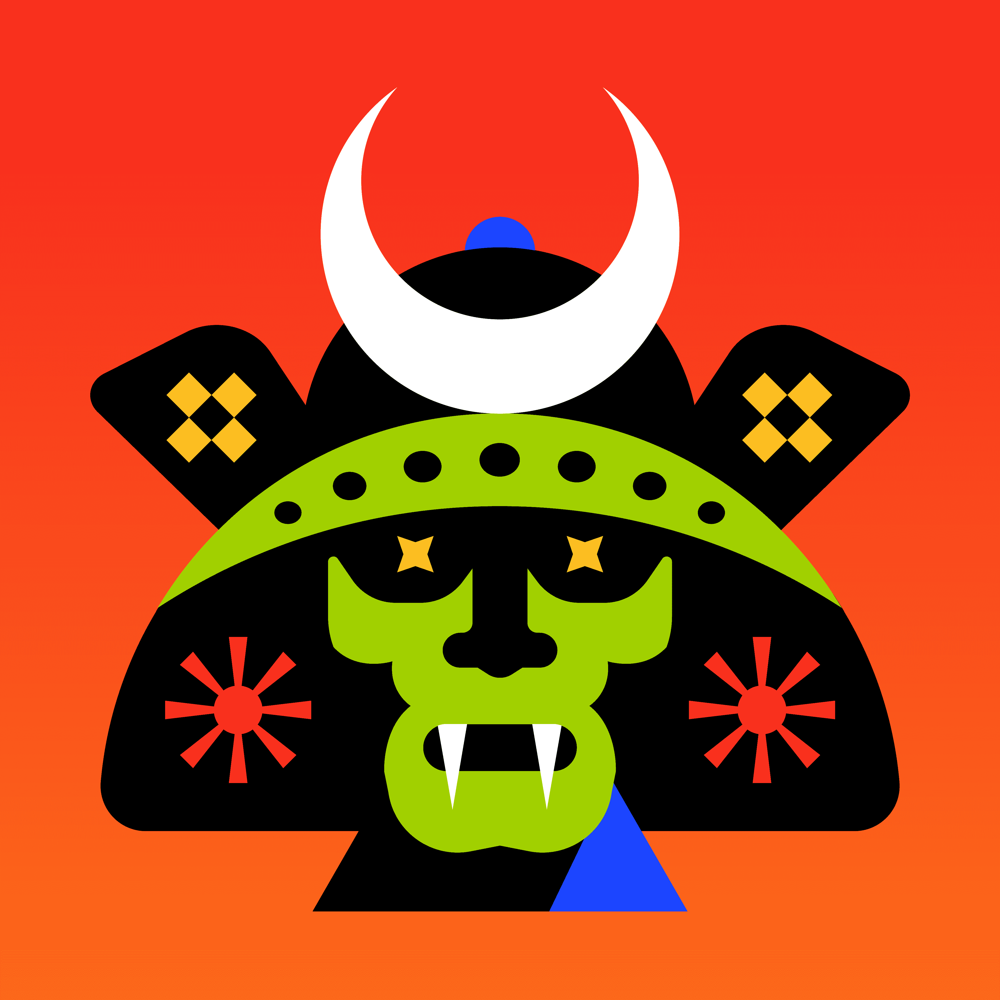

# Bushidos

武士道是一个来自遥远世界的独特武士部落。 探索这些大胆勇敢的保护者的故事。 漫画系列于 2022 年夏季发行。

在任何 NFT 市场上浏览武士道或浪人系列，并立即加入我们的勇士社区。

武士道是一个由 8,888 名武士组成的部落，旨在维护区块链的去中心化并防止 FUD。

2021 年 10 月，武士道一族的勇士们将苏醒，寻找带领他们的人。 你会在那儿吗？

武士道是一场文化运动，而不是一次性完成的 NFT 项目。 我们的目标是围绕武士传说和文化主题发展一个活跃的创意社区。 这仅仅是个开始。

