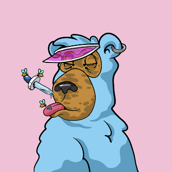

# Buzzed Bear Hideout

.png)

我们是一个由聪明、有才华的人组成的社区，他们希望建立一个我们可以引以为豪的组织。当您购买我们的一件 NFT 时，您购买的不仅仅是一件富有创意、异想天开的艺术品。您还将进入一个令人惊叹的人员组织的底层。BBH 不仅仅是一个社区，我们是一个 DAO（去中心化自治组织）。每个 Buzzed Bear 都可以提出、投票和执行任何新举措。我们的蜜罐资金从初始铸币厂收入的 50% 开始，并持续由所有二级销量的 4% 以及我们的举措带来的利润提供资金。我们可以将这笔资金用于营销、促销和社区投票支持的其他计划。去中心化 = 没有地毯！该项目的开发人员确保权力真正掌握在社区手中。事实上，我们多重签名钱包上的两个签名是由社区中可信赖的熊持有的，他们根本不属于开发团队。如果您不仅仅是一个被动的投资者，我们一直在寻找能够在组织中发挥积极作用的人。我们的 Discord 服务器和治理论坛向所有持有者开放，我们始终欢迎新的想法。你会在藏身处选择什么角色？即将推出 虽然一些 NFT 项目通过以没有实际价值的“实用代币”的形式引入虚假价值来稀释自己的生态系统，但我们已投票决定推迟熊 Staking，直到我们拥有适当的基础设施来为生态系统提供持久价值。该基础设施的一部分需要外部法律顾问，我们目前正在与他们协商。我们相信这是确保我们所有的熊都避免法律/税务问题并确保组织遵守法规的最佳方法。

去中心化 = 没有地毯！

