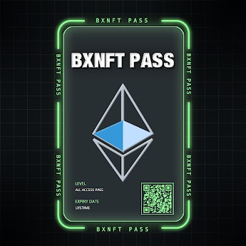

# BXNFT PASS

**BXNFT 通行证**

购买PASS卡，可以享受BXNFT工具，热门功能：图狗freemint自动mint，mint项目速度排行榜、项目蓝筹指数，交易跟踪，社群跟踪，我的NFT,Mint排行榜，成交量跟踪，巨鲸列表，巨鲸跟踪项目等功能

##### ▶ 什么是 BXNFT 通行证？

BXNFT PASS 是一个 NFT（Non-fungible token）集合。存储在区块链上的数字艺术品集合。

##### ▶ 有多少个 BXNFT PASS 代币？

总共有 384 个 BXNFT PASS NFT。目前 224 位所有者的钱包中至少有一个 BXNFT PASS NTF。

##### ▶ 最昂贵的 BXNFT PASS 销售是什么？

出售的最昂贵的 BXNFT PASS NFT 是 BXNFT PASS。它于 2022 年 6 月 29 日（2 个月前）以 59.3 美元的价格售出。

##### ▶ 最近卖出了多少 BXNFT PASS？

过去 30 天内售出了 116 个 BXNFT PASS NFT。

##### ▶ BXNFT PASS 的费用是多少？

在过去 30 天内，最便宜的 BXNFT PASS NFT 销售额低于 11 美元，最高销售额超过 47 美元。在过去 30 天内，BXNFT PASS NFT 的中位价格为 33 美元。

