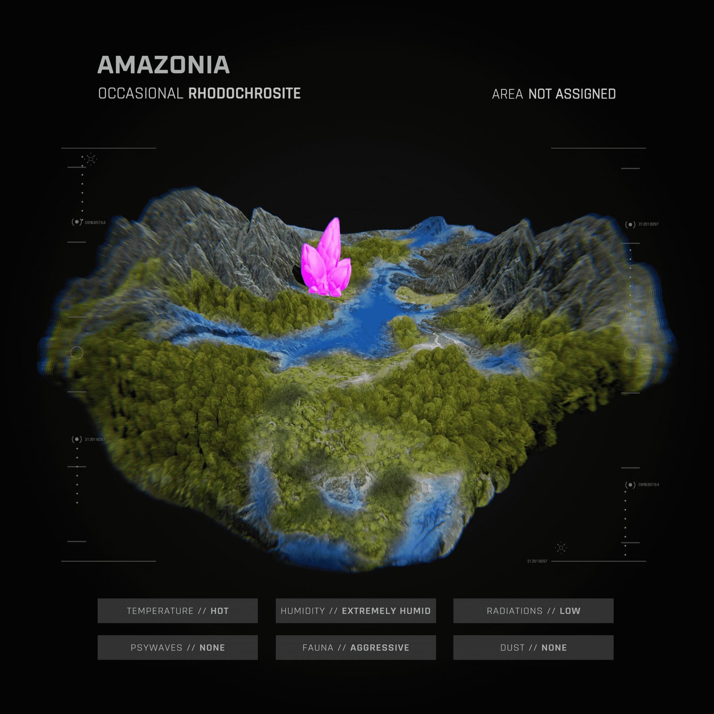

# BYOLAND

改变您的数字世界无论是道具还是视觉体验，随身携带钥匙，在每个即将到来的元宇宙中释放角色的全部大脑潜力，以及我们自己的BYOVerse。

拜欧克拉夫特BYOCrafts是3D的，游戏就绪的车辆，准备漫游BYOVERSE。通过可自定义的附件，BYOCrafts可以升级，让你在即将到来的比赛中占据优势，或者用于在战斗中击败对手。

BYOPills充当消耗品，在区块链游戏和虚拟世界（包括我们自己的BYOVERSE）中提供不同的道具，能力提升和/或视觉效果。它们还授予持有者访问未来游戏资产掉落的权限，每个资产掉落都有自己的效用。

在4种不同类型的使徒中随机生成超过365个特征，包括：旅行者，精神病患者，古人和女神，有成千上万的化身可供浏览。多达7，642个创世使徒将被铸造出来。

