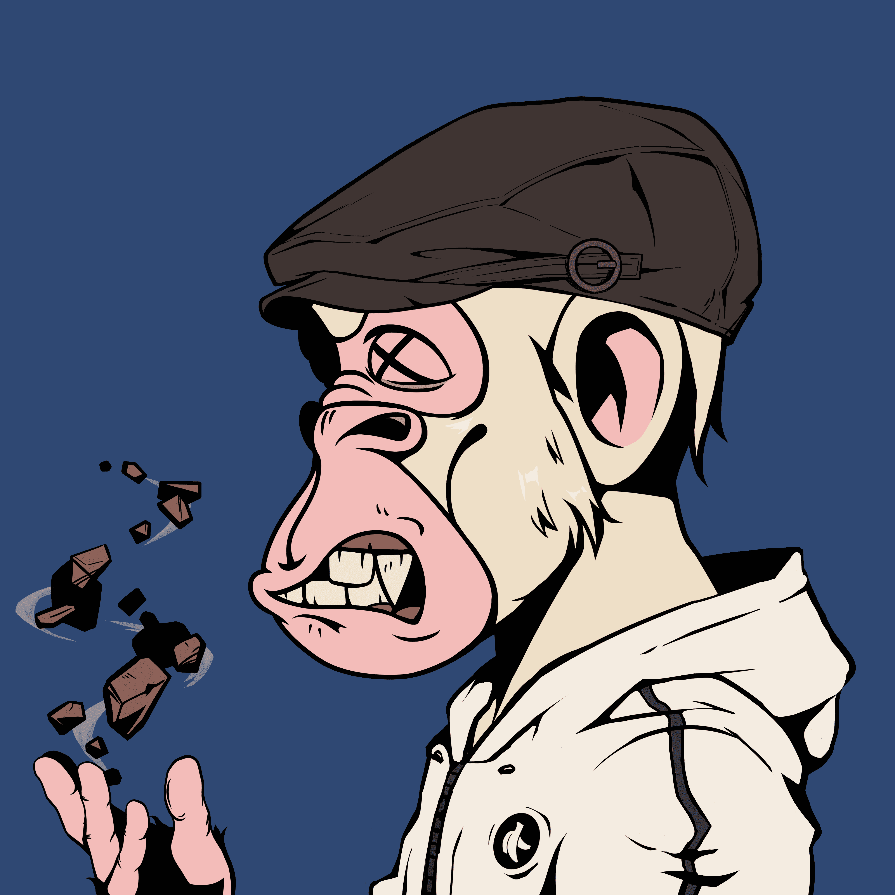

# BZUKI a.k.a. BoredZUKI

BZUKI (a.k.a. BoredZUKI) 是一个包含 3,333 个头像的集合，其中包含即将推出的 MetaIsland 和一个游戏社区。 在岛上，我们融合、构建、互动、聚会。 日常活动。 古伯斯赢了。 呜呜呜。 猿一起强大而有趣！

什么是 BZUKI 又名 BoredZUKI？
BZUKI a.k.a. BoredZUKI 是一个 NFT（非同质代币）集合。存储在区块链上的数字艺术品集合。
▶ 存在多少 BZUKI 又名 BoredZUKI 代币？
总共有 3,333 个 BZUKI 又名 BoredZUKI NFT。目前，1,470 位车主的钱包中至少有一个 BZUKI 又名 BoredZUKI NTF。
▶ 最昂贵的 BZUKI a.k.a. BoredZUKI 销售是什么？
最昂贵的 BZUKI 又名 BoredZUKI NFT 是 Bzuki #1691。它于 2022 年 6 月 29 日（2 个月前）以 219.6 美元的价格售出。
▶ 最近卖出了多少 BZUKI a.k.a. BoredZUKI？
过去 30 天内售出了 75 个 BZUKI 又名 BoredZUKI NFT。
▶ BZUKI a.k.a. BoredZUKI 多少钱？
在过去 30 天里，最便宜的 BZUKI（又名 BoredZUKI）NFT 销售额低于 13 美元，最高销售额超过 76 美元。 BZUKI a.k.a. BoredZUKI NFT 的中位价格在过去 30 天内为 22 美元。
▶ 什么是流行的 BZUKI a.k.a. BoredZUKI 替代品？
许多拥有 BZUKI a.k.a. BoredZUKI NFT 的用户还拥有 NMSL NFT、Birdzuki、0xMonkey 和 Zukibirds。

