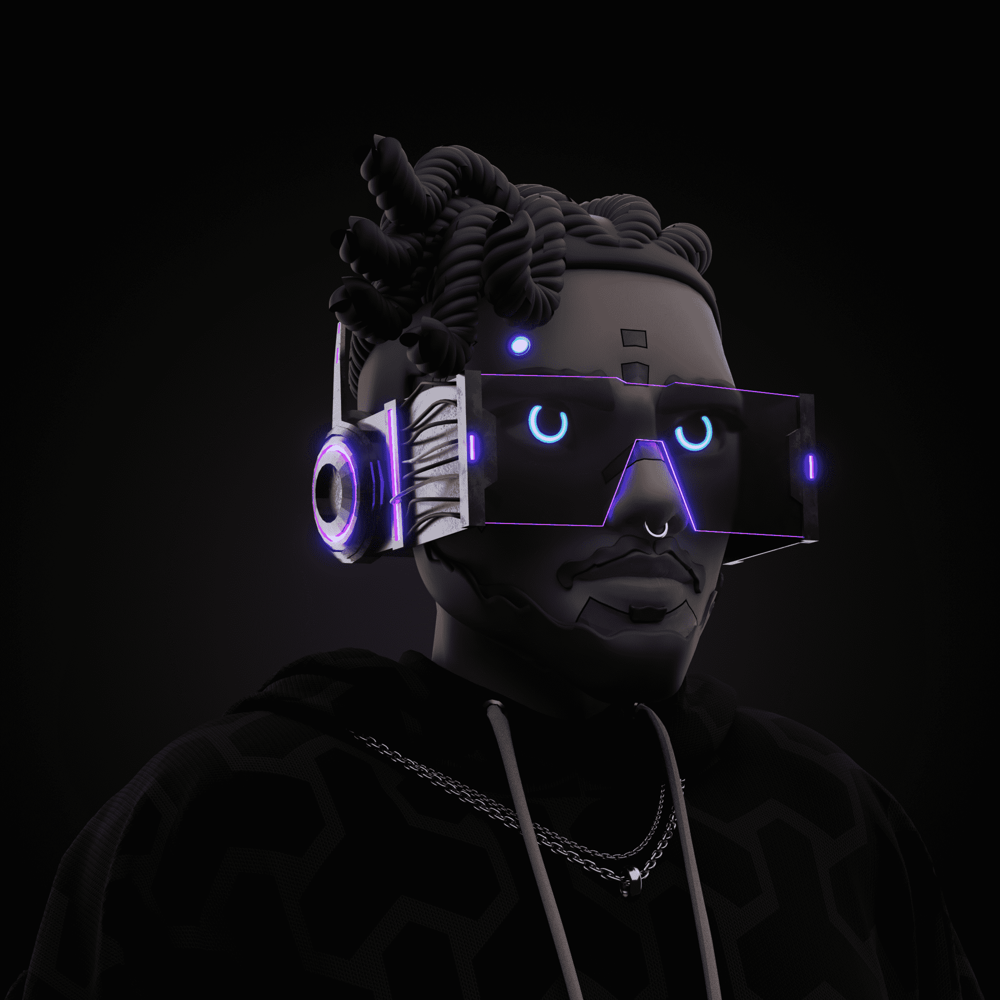

# C86 Cyborg

作为官方 DAO，Cyborg 86 是 8,600 个独特的 Cyborg NFT 的集合，它们存在于以太坊区块链上。 我们在我们的企业家 Metaverse 俱乐部里放松。 在这里，您可以与我们对 Web 3.0 感兴趣的企业家社区发展您的网络

CYDOG86是CYBORG86的第二个系列。它们的创建是为了奖励拥有朋友的持有者，一种无论如何都会永远和他们在一起的宠物。Cydogs作为ERC-721令牌存储在以太坊区块链中，并托管在行星际文件系统（IPFS）上。

CYBORG 86代表了8，600个独特的半机械人的集合，这些半机械人按稀有度分类，并生成了数百种元素。
CYBORGS作为ERC-721令牌存储在以太坊区块链上，并托管在行星际文件系统（IPFS）上。

我们的目标是创建一个由投资者和企业家组成的社区，他们聚集在Web 3.0机会周围。

