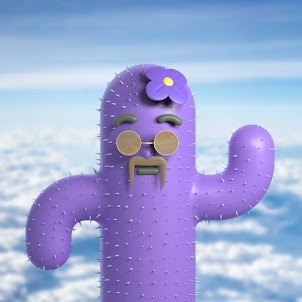

# Cacti Club

为了拯救人类的本质，一位失败的疯狂科学家将 9999 颗仙人掌植入人类灵魂，然后以我们濒临灭绝的物种的名义将它们送入银河系，殖民一个不起眼的沙漠星球。仙人掌俱乐部除了刺痛、令人印象深刻的保水性和对区块链的模糊理解外，什么都没有，是人类最后的希望。

##### ▶ 777 Cacti Club 代币有多少？

总共有 491 777 个 Cacti Club NFT。目前，254 位车主的钱包中至少有一个 777 Cacti Club NTF。

##### ▶ 最昂贵的 777 Cacti Club 销售是什么？

售出的最昂贵的 777 Cacti Club NFT 是 Cacti Club #0432。它于 2022-06-16（2 个月前）以 1.4 美元的价格出售。

##### ▶ 777 Cacti Club 最近卖出了多少？

过去 30 天内共售出 1777 个 Cacti Club NFT。

