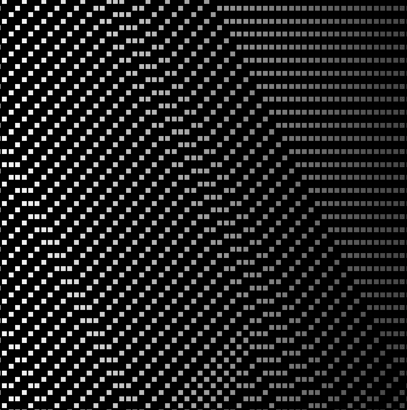

# CAIC - Cellular Automata In Chain

CAIC（链中元胞自动机）项目是关于基于智能合约中的一维自动机生成图像。 每个图像都是完全链上的，不需要任何后期处理。

CAIC - Cellular Automata In Chain 的总销量为 $53.46。 一台 CAIC - Cellular Automata In Chain NFT 的平均价格为 26.7 美元。 有 250 个 CAIC - Cellular Automata In Chain 所有者，拥有 545 个代币的总供应量。

什么是 CAIC - 链中元胞自动机？
CAIC - 链中元胞自动机是一个 NFT（不可替代令牌）集合。 存储在区块链上的数字艺术品集合。
▶ CAIC - Cellular Automata In Chain 代币有多少？
总共有 545 个 CAIC - 链式 NFT 元胞自动机。 目前，250 位所有者的钱包中至少有一个 CAIC - Cellular Automata In Chain NTF。
▶ 什么是最昂贵的 CAIC - Cellular Automata In Chain 销售？
最昂贵的 CAIC - Cellular Automata In Chain NFT 是 Grid #493。 它于 2022-08-30（3 天前）以 26.7 美元的价格售出。
▶ CAIC - Cellular Automata In Chain 最近卖出了多少台？
过去 30 天内售出了 2 个 CAIC - Cellular Automata In Chain NFT。

