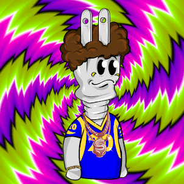

# CaliPlug

加入我们的旅程，我们将 Legal Cannabis 与区块链技术相结合，并在 Metaverse 中开设我们的药房。

.png)

##### ▶ 什么是 CaliPlug？

CaliPlug 是一个 NFT（不可替代令牌）集合。存储在区块链上的数字艺术品集合。

##### ▶ 有多少个 CaliPlug 代币？

总共有 1,387 个 CaliPlug NFT。目前，359 位所有者的钱包中至少有一个 CaliPlug NTF。

##### ▶ 什么是最昂贵的 CaliPlug 销售？

出售的最昂贵的 CaliPlug NFT 是 CaliPlug #573。它于 2022-06-18（2 个月前）以 120.8 美元的价格售出。

##### ▶ 最近卖出了多少个 CaliPlug？

过去 30 天内售出了 3 个 CaliPlug NFT。

