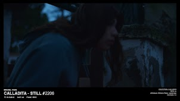

# Calladita Collection

##### ▶ 什么是 Calladita 系列？

Calladita Collection 是一个 NFT（非同质代币）集合。存储在区块链上的数字艺术品集合。

##### ▶ 有多少个 Calladita Collection 代币？

总共有 864 个 Calladita Collection NFT。目前，408 位车主的钱包中至少有一个 Calladita Collection NTF。

##### ▶ 最昂贵的 Calladita Collection 销售是什么？

出售的最昂贵的 Calladita Collection NFT 是 Calladita Tier 1 – Still #700。它于 2022-06-27（2 个月前）以 153.7 美元的价格售出。

##### ▶ 最近卖出了多少 Calladita Collection？

过去 30 天内售出了 1 个 Calladita Collection NFT。

**截止至8月29日**

881**项目**

445**拥有者**

2.1**总容积**

0.3**底价**
