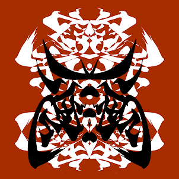

# Calligraphy Devils

同一个人可以表现出甚至他/她都不知道的丑陋和美丽，这取决于他/她在任何特定时间的感受、位置和位置。这个概念是创造一个不排斥人类多面性的世界。

.png)

##### ▶ 什么是书法鬼？

Calligraphy Devils 是一个 NFT（非同质代币）集合。存储在区块链上的数字艺术品集合。

##### ▶ 有多少个书法恶魔代币？

总共有 69 个书法恶魔 NFT。目前有 25 位车主的钱包里至少有一本 Calligraphy Devils NTF。

##### ▶ 什么是最昂贵的书法魔鬼销售？

最贵的 Calligraphy Devils NFT 是 Calligraphy Devil #67。它于 2022 年 6 月 23 日（2 个月前）以 5.5 美元的价格售出。

##### ▶ 最近卖出了多少个书法鬼？

过去 30 天内共售出 2 个 Calligraphy Devils NFT。

