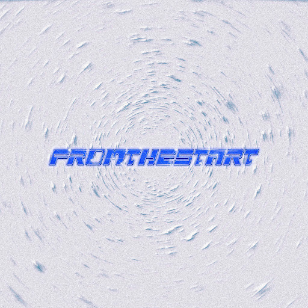
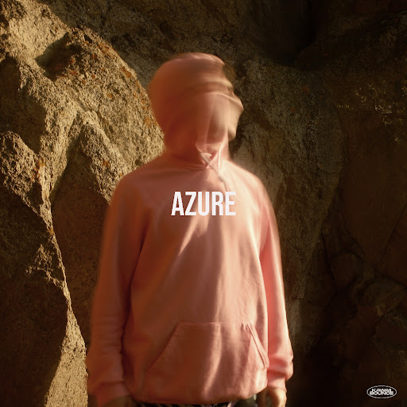

# camoufly

##### ▶ 什么是迷彩？

camoufly 是一个 NFT（非同质代币）集合。存储在区块链上的数字艺术品集合。

##### ▶ 迷彩代币有多少？

总共有 90 个 camoufly NFT。目前，68 位车主的钱包中至少有一个迷彩 NTF。

##### ▶ 最昂贵的迷彩促销是什么？

出售的最昂贵的 camoufly NFT 是 FROM THE START #7。它于 2022 年 6 月 28 日（2 个月前）以 425.9 美元的价格售出。

##### ▶ 最近卖了多少迷彩？

过去 30 天内售出了 4 个 camoufly NFT。

**截止至8月29日**

90**项目**

67**拥有者**

12.9**总容积**

0.34**底价**
