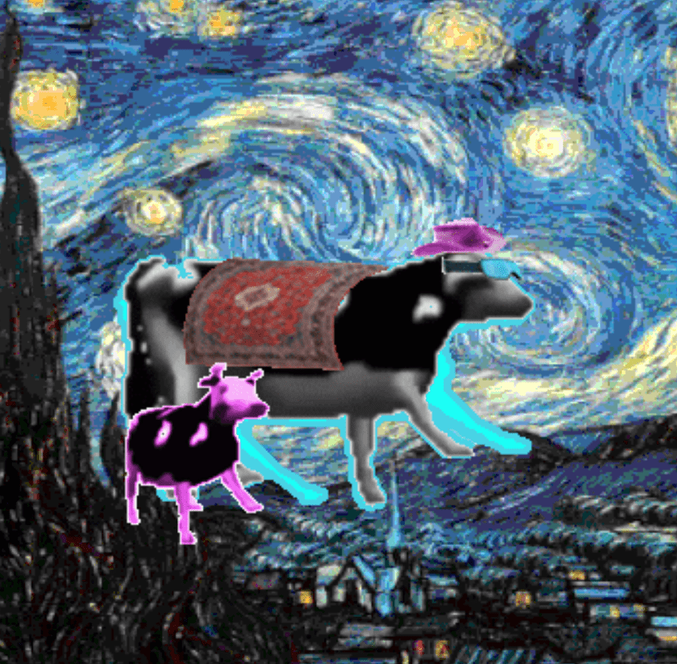

# Cancerous Cows

未来所有版税的 80% 将捐赠给美国癌症协会，以支持抗击癌症。 传播MOOWS！ 🐮 🥛

Cancerous Cows 的总销售额为 2.42 美元。 一只 Cancerous Cows NFT 的平均价格为 2.4 美元。 有 1,466 名 Cancerous Cows 所有者，拥有 3,333 个代币的总供应量。

什么是癌性奶牛？
Cancerous Cows 是一个 NFT（不可替代代币）集合。 存储在区块链上的数字艺术品集合。
▶ 存在多少 Cancerous Cows 代币？
总共有 3,333 个 Cancerous Cows NFT。 目前，1,466 位车主的钱包中至少有一个 Cancerous Cows NTF。
▶ 最昂贵的 Cancerous Cows 销售是什么？
售出的最昂贵的 Cancerous Cows NFT 是 Cancerous Cow #3083。 它于 2022-06-21（2 个月前）以 5.5 美元的价格售出。
▶ 最近卖出了多少头癌牛？
过去 30 天内售出了 6 个 Cancerous Cows NFT。
▶ 什么是流行的 Cancerous Cows 替代品？
许多拥有 Cancerous Cows NFT 的用户还拥有 OmniMonke (eth)、BouncingZoo、Harrys Hammer Club 和 POTO Official。

